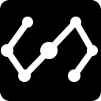
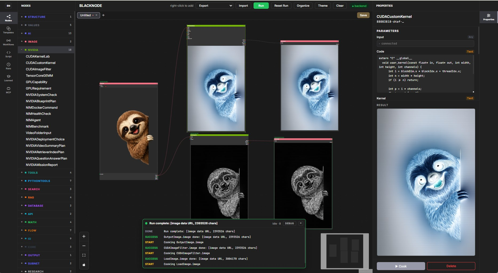

<p align="center">
  
</p>

# Blacknode

[](https://github.com/temiroff/Blacknode/actions/workflows/ci.yml)

**A visual runtime for AI, GPU computing, and robotics.**

**Blacknode detects, launches, monitors, and safely controls supported robots
through the same visible workflow runtime used for AI and GPU tasks.**

Blacknode turns agent intent and user ideas into typed, visible, runnable
workflows. Agents get a structured control surface through MCP, HTTP, and
WebSocket APIs instead of guessing JSON, and users get a live graph they can
inspect, run, replay, stop, and export.

Workflows export to plain Python, class-based Python, LangGraph, CrewAI,
AutoGen, OpenAI Swarm, and an NVIDIA Agent Stack manifest, with NVIDIA NIM and
AI-Q/NeMo Agent Toolkit workflow paths built in.

Blacknode stays generic at the core, while extension packages add first-class
systems for CUDA, ROS 2, robot vision, local/hosted models, simulation, and
hardware-specific robots. Together they support visual-first embodied AI:
prototype with graphs, inspect every edge, and run the same behavior in a local
process, workstation, Jetson, robot, simulator, or cloud runtime.

<table>
  <tr>
    <td colspan="2"><a href="docs/images/blacknode-cuda-custom-kernels.jpg"></a></td>
  </tr>
  <tr>
    <td><a href="docs/images/blacknode-light-theme.png"></a></td>
    <td><a href="docs/images/blacknode-launcher.png"></a></td>
  </tr>
  <tr>
    <td><a href="docs/images/blacknode-mcp-nim-editor-demo.png"></a></td>
    <td><a href="docs/images/blacknode-research-pipeline.png"></a></td>
  </tr>
</table>

<table>
  <tr>
    <td>
      <video src="https://github.com/user-attachments/assets/9debbc72-68d7-4717-9a44-433ae65fd4d2" controls width="420"></video>
    </td>
    <td>
      <video src="https://github.com/user-attachments/assets/16a0d311-f237-4d6f-9fec-c303fc3e41d0" controls width="420"></video>
    </td>
  </tr>
</table>

## Start Here

Clone Blacknode and run its launcher. The first run creates an isolated Python
environment, installs the backend and editor dependencies, starts both services,
and opens the browser. Later starts reuse the installed dependencies.

Windows:

```powershell
git clone https://github.com/temiroff/Blacknode.git
cd Blacknode
.\start.bat
```

macOS/Linux:

```bash
git clone https://github.com/temiroff/Blacknode.git
cd Blacknode
chmod +x start.sh
./start.sh
```

Python 3.11+ and Node.js 20.19+ or 22.12+ are required. A warm start normally
takes less than a minute; first-run time depends on network and package caches.

On the first launch of a Blacknode workspace, the editor opens **Packages** with
a one-time welcome message. Install the official packages needed for robotics,
ROS 2, vision, CUDA, datasets, and training workflows, or continue directly
with the core graph. The acknowledgement is stored locally in
`.blacknode/onboarding.json`, and the Packages tab remains available in the
left sidebar.

Continue with the [Beginner Walkthrough](docs/walkthrough.md).

It shows the exact commands to run, buttons to press, templates to open, results
to expect, NVIDIA NIM paths, MCP setup, framework export, Docker Compose,
custom nodes, run history, and troubleshooting.

## Connect an SO-ARM101

The SO-ARM101 workflow covers discovery, driver startup, live state, bounded
movement, and shutdown:

```text
Plug in SO-ARM101
  → select the tested preset
  → start the driver
  → verify live joint state
  → arm one bounded movement
  → Stop all safely
```

The **SO-ARM101 Motion Test** template includes one connection dashboard
for USB, driver, ROS 2, and live-pose readiness. Motion remains disarmed until
the operator explicitly enables it. The shipped cube-follow workflow can turn
the shoulder toward a colored cube using a USB camera, OpenCV tracking, and a
safety-gated ROS 2 controller.

Use the [SO-ARM101 quickstart](docs/so-arm101-quickstart.md) for setup, safety
checks, controlled movement, shutdown, and the visual-follow workflow.

## Why Blacknode

Chat agents are good at intent and iteration. They are weak at showing durable
workflow state. Blacknode gives agents a typed workflow editor: they can create
nodes, connect ports, validate the graph, run it, debug failures, replay the
execution, and export the result as code.

## Extension Packages

The base app stays small. Node libraries ship as **extension packages** —
separate git repositories cloned into `packages/`:

```bash
blacknode packages install git@github.com:temiroff/blacknode-cuda.git
```

Blacknode discovers each package at startup and registers its nodes, palette
categories, and workflow templates. Delete the folder to remove it; a broken
or missing package never breaks the core. Manage everything from the editor's
**Packages** tab, and write your own package by copying
[blacknode-cuda](https://github.com/temiroff/blacknode-cuda) — see
[Extension Packages](docs/packages.md).

## Feature Map

| Feature | What it gives you | Read more |
|---|---|---|
| Visual workflow editor | Build and inspect typed node graphs with visible execution state. | [Beginner Walkthrough](docs/walkthrough.md) |
| Agent control surface | MCP, HTTP, and WebSocket APIs for agents to create, connect, validate, run, save, inspect, and export workflows. | [Agent Guide](docs/agent-guide.md), [MCP Quickstart](docs/quickstart-mcp.md) |
| NVIDIA workflow surface | Hosted/local NIM, Nemotron query rewriting, NeMo Retriever embedding and reranking, visual RAG comparison, benchmarks, AI-Q/NeMo Agent Toolkit integration, and streamable HTTP MCP. | [NVIDIA Mission Control](docs/nvidia-mission-control.md), [NVIDIA Visual RAG](docs/nvidia-visual-rag.md), [Blacknode and NVIDIA AI-Q](docs/aiq-integration.md) |
| GPU/CUDA blocks | Real CUDA kernels, custom NVRTC-compiled kernels, GPU image nodes, and capability/preflight nodes that run on your local NVIDIA GPU — shipped as the [blacknode-cuda](https://github.com/temiroff/blacknode-cuda) extension package. | [NVIDIA GPU Blocks](docs/nvidia-gpu-blocks.md) |
| Local chat agents | Control a local Blacknode workflow through Telegram long polling or Slack Socket Mode, with editor start/stop, live status, tools, images, and replay. | [Local Telegram Agent](docs/telegram-nim-demo.md), [Slack Agent](docs/slack-nim-demo.md) |
| Typed ports and validation | Text, Int, Float, Bool, List, Dict, Embedding, Fn, Model, Number, Any, cycle checks, and MCP repair suggestions. | [Workflow Schema](docs/workflow-schema.md), [Agent Skill](.agents/skills/blacknode-workflow/SKILL.md) |
| Run history and replay | Event logs, model calls, tool calls, node timings, final values, and errors. | [Beginner Walkthrough](docs/walkthrough.md) |
| Custom nodes | Persistent editor-created nodes, Python decorator nodes, auto-discovery, and community node packs. | [Custom Nodes](docs/custom-nodes.md) |
| Extension packages | Modular node libraries in separate git repos (`blacknode-cuda`, ...) cloned into `packages/` — install, remove, or write your own without touching the core app. | [Extension Packages](docs/packages.md) |
| Robotics and vision packages | Generic USB/driver setup through `blacknode-robot`, native/rosbridge ROS 2 transport/control through `blacknode-ros2`, and camera/CV2/VLM reasoning through `blacknode-vision`. | [Extension Packages](docs/packages.md) |
| Robot episode datasets | Crash-recoverable synchronized teleoperation and camera recording, dataset validation, HDF5 and structured Parquet/MP4 exports, and explicit repository publishing through `blacknode-dataset`. | [Robot episode datasets](docs/episode-datasets.md) |
| Native robot policy training | Optional PyTorch vision-and-state action-chunking training, resumable checkpoints, metrics dashboards, and recorded-frame policy previews through `blacknode-training`. | [Native robot policy training](docs/robot-policy-training.md) |
| Learned nodes | MCP agents can create reusable Docker-sandboxed node types that appear live in the editor palette. | [Learned Nodes](docs/learned-nodes.md) |
| Python round-trip | Export readable Python, import it back into the editor, and live-sync Python runs into replay. | [Python Round-Trip](docs/python-roundtrip.md) |
| Framework export | Turn a visual graph into Python, LangGraph, CrewAI, AutoGen, OpenAI Swarm, or an NVIDIA Agent Stack manifest. | [Framework Export](docs/framework-export.md) |
| Self-hosted deployment | Run the editor, backend, and HTTP MCP server locally, on a VM, or in an on-prem demo stack. | [Docker Compose](docs/docker-compose.md), [Docker Publishing](docs/docker-publish.md) |

## Learned Nodes

Agents connected via MCP can create new permanent node types when no existing
node fits a task. Generated nodes:

- Are stored as plain Python in `nodes/learned/<name>/`
- Execute inside a Docker sandbox with no network by default
- Appear live in the editor palette under "Learned" or a chosen category
- Persist across sessions and are reusable
- Can be promoted into `custom-nodes/` or `community-nodes/` when stable

Requires Docker. Run `blacknode doctor` to verify your setup.

See [docs/learned-nodes.md](docs/learned-nodes.md) for details and
[docs/learned-nodes-test-plan.md](docs/learned-nodes-test-plan.md) for the
step-by-step test path.

## NVIDIA Agent Stack

Blacknode complements NVIDIA AI-Q and NeMo Agent Toolkit by giving agent
harnesses a visual workflow surface. AI-Q can research and reason over
enterprise data; Blacknode turns agent intent into typed, visible, runnable
workflows through MCP.

**Blacknode is the visual workflow editor for the NVIDIA agent stack.**

See [Blacknode and NVIDIA AI-Q](docs/aiq-integration.md) and
[NVIDIA Mission Control](docs/nvidia-mission-control.md).

## Documentation

### First Run

| Guide | Use it for |
|---|---|
| [Beginner Walkthrough](docs/walkthrough.md) | Step-by-step setup, editor use, CLI checks, NVIDIA workflows, MCP, Docker, and troubleshooting. |
| [MCP Quickstart](docs/quickstart-mcp.md) | Connecting Blacknode to an MCP client. |
| [MCP Test Prompts](docs/mcp-test-prompts.md) | Copy-paste prompts for proving agent workflow control. |

### NVIDIA

| Guide | Use it for |
|---|---|
| [NVIDIA NIM Quickstart](docs/nvidia-nim-demo.md) | Run a hosted NVIDIA NIM workflow through MCP and the editor. |
| [NVIDIA Mission Control](docs/nvidia-mission-control.md) | NVIDIA nodes, templates, local readiness, local NIM launch, and benchmark flow. |
| [NVIDIA Visual RAG Comparator](docs/nvidia-visual-rag.md) | Compare original and Q2E retrieval with NVIDIA embeddings, reranking, cited answers, and run replay. |
| [Blacknode and NVIDIA AI-Q](docs/aiq-integration.md) | Connect AI-Q or NeMo Agent Toolkit to Blacknode over streamable HTTP MCP. |

### Deployment

| Guide | Use it for |
|---|---|
| [Local Telegram Agent](docs/telegram-nim-demo.md) | Exposing a locally controlled workflow through Telegram, including tools, images, memory, long polling, lifecycle controls, security, and troubleshooting. |
| [Integration Drivers](docs/drivers.md) | Driver architecture, readiness states, editor lifecycle, and adding another transport. |
| [Docker Compose](docs/docker-compose.md) | Running the editor, backend, and HTTP MCP server as a self-hosted stack. |
| [Docker Publishing](docs/docker-publish.md) | Publishing prebuilt server/editor images to GHCR and running without local builds. |

### Workflow Reference

| Guide | Use it for |
|---|---|
| [Workflow Schema](docs/workflow-schema.md) | The saved workflow JSON format. |
| [Workflow JSON Schema](docs/workflow.schema.json) | Machine-readable schema for validation and tooling. |
| [Framework Export](docs/framework-export.md) | Exporting workflows to Python, LangGraph, CrewAI, AutoGen, Swarm, REST, and WebSocket control. |
| [Python Round-Trip](docs/python-roundtrip.md) | Export Python, import Python back into the editor, and live-sync Python runs into replay. |
| [Custom Nodes](docs/custom-nodes.md) | Persistent editor-created nodes, auto-discovery, community node packs, and node library extension. |
| [Extension Packages](docs/packages.md) | Modular node libraries as separate git repos: manifest format, install via CLI or clone, package-shipped templates. |
| [NVIDIA GPU Blocks](docs/nvidia-gpu-blocks.md) | Real CUDA/GPU nodes: curated ops, image workflows, custom NVRTC kernels, capability detection, and preflight, with measured speedups. |
| [Learned Nodes](docs/learned-nodes.md) | MCP-created reusable nodes, opt-in behavior, editor behavior, and user workflow. |
| [Learned Nodes Test Plan](docs/learned-nodes-test-plan.md) | Step-by-step commands for validating Docker, MCP, editor refresh, consent, and the camera demo dry run. |
| [Learned Nodes Internals](docs/learned-nodes-internals.md) | Registry wiring, manifest schema, execution wrapper, and SSE events. |
| [Learned Nodes Sandbox](docs/learned-nodes-sandbox.md) | Docker image, runtime limits, configuration, and troubleshooting. |
| [Agent Guide](docs/agent-guide.md) | How agents route workflow construction, reusable development, and package work. |
| [Repository Agent Instructions](AGENTS.md) | Always-on repository map, invariants, safety rules, and verification commands. |
| [Blacknode Workflow Skill](.agents/skills/blacknode-workflow/SKILL.md) | Build, validate, run, inspect, and export graphs using core and package nodes. |
| [Blacknode Development Skill](.agents/skills/blacknode-development/SKILL.md) | Extend core, editor, MCP, reusable nodes, and extension packages. |

## Demos

| Demo | What it shows |
|---|---|
| [MCP + NVIDIA NIM preview](https://github.com/user-attachments/assets/9debbc72-68d7-4717-9a44-433ae65fd4d2) | Claude opens, organizes, and cooks an NVIDIA NIM workflow through MCP. |
| [Run workflow live replay](https://github.com/user-attachments/assets/16a0d311-f237-4d6f-9fec-c303fc3e41d0) | The editor runs a visible graph with live node highlights and run replay. |
| `python scripts/complex_learned_demo.py --mock-sandbox` | Deterministic learned-node plumbing test with fixture text, categorized nodes, and a 14-node workflow. Not a real-world data demo. |
| `python scripts/real_repo_learned_demo.py --target . --open-editor` | Real-world local repo audit: samples actual files from `--target`, creates learned nodes, opens a 14-node graph, and reports findings from that input. |

## Visuals

| Preview | Link |
|---|---|
| CUDA custom kernel image workflow | [docs/images/blacknode-cuda-custom-kernels.jpg](docs/images/blacknode-cuda-custom-kernels.jpg) |
| MCP + NVIDIA NIM editor demo | [docs/images/blacknode-mcp-nim-editor-demo.png](docs/images/blacknode-mcp-nim-editor-demo.png) |
| Claude Desktop MCP connector | [docs/images/blacknode-mcp-claude-connector.png](docs/images/blacknode-mcp-claude-connector.png) |
| Research pipeline template | [docs/images/blacknode-research-pipeline.png](docs/images/blacknode-research-pipeline.png) |
| Light theme | [docs/images/blacknode-light-theme.png](docs/images/blacknode-light-theme.png) |
| Dark theme | [docs/images/blacknode-dark-theme.png](docs/images/blacknode-dark-theme.png) |

## Project Map

| Path | Purpose |
|---|---|
| `python/blacknode/` | Python workflow runtime, node registry, providers, CLI, and MCP server. |
| `editor-server/` | FastAPI backend for the visual editor, cook API, workflows, and runs. |
| `editor/` | React visual workflow editor. |
| `templates/` | Tracked starter workflows. |
| `packages/` | Extension packages — separate git repos cloned in place (e.g. `blacknode-cuda`). |
| `workflows/` | Local saved workflows, ignored by git. |
| `docs/` | Walkthroughs, integration guides, workflow schema, and example assets. |
| `AGENTS.md` | Repository-wide coding-agent routing and development rules. |
| `skills/` | Canonical distributable Blacknode workflow and development skills. |
| `docker-compose.yml` | Self-hosted editor, backend, and streamable HTTP MCP stack. |
| `crates/` | Rust crates and no-server CLI. |

## License

Blacknode is licensed under the Apache License 2.0. See [LICENSE](LICENSE) for
the full license text.
