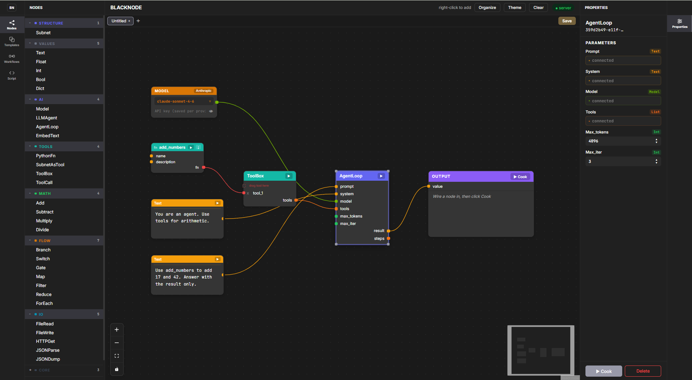

# Blacknode

A node-based framework for building AI agent pipelines — scriptable in Python, visual in the browser.

---

## Screenshots

### Light theme


### Dark theme



---

## Quick Start

### Prerequisites

| Tool | Version | Download |
|---|---|---|
| Python | 3.10 + | https://python.org |
| Node.js | 18 + | https://nodejs.org |

### First-time setup (run once)

```bat
cd editor-server
pip install -r requirements.txt

cd ..\editor
npm install
```

### Starting the editor

**Windows — double-click `start.bat`** (at the repo root).

It opens two terminal windows (Python server + Vite dev server) and then launches the browser at `http://localhost:3000` automatically.

**Manual start (any OS):**

```bash
# Terminal 1 — Python backend
cd editor-server
python server.py
# → http://127.0.0.1:7777

# Terminal 2 — React frontend
cd editor
npm run dev
# → http://localhost:3000
```

Both must be running at the same time. The status indicator in the top bar turns green when the server is reachable.

> **After any Python code change** you must restart the Python server (`Ctrl+C` → `python server.py`) for the new node types and port colors to take effect.

---

## Setting up API keys

API keys are entered directly in the **Model node** on the canvas — no `.env` file needed.

1. Add a **Model** node from the AI category in the palette (or load any LLM template)
2. Pick your model from the dropdown
3. Paste your API key in the field below the dropdown
4. Click the 👁 button to verify it, then press Enter or click away

Keys are saved per provider in your browser's `localStorage` and automatically sent to the server on every page load.

| Provider | Where to get a key |
|---|---|
| Anthropic | https://console.anthropic.com |
| OpenAI | https://platform.openai.com/api-keys |
| NVIDIA NIM | https://build.nvidia.com (free tier available) |

---

## Using the editor

### Adding nodes

- **Right-click** the canvas → type to search → click or press Enter
- **Drag** a node from the left palette onto the canvas
- **Click** a node in the palette to place it at a random position

### Connecting nodes

Drag from an output handle (right side of a node) to an input handle (left side). Handles are color-coded by type — you can only connect matching types.

| Handle color | Type |
|---|---|
| 🟡 Amber | Text |
| 🟢 Green | Int / Float |
| 🟢 Bright green | Model (AI model identifier) |
| 🔵 Blue | Bool |
| 🟠 Orange | List |
| 🟣 Purple | Dict |
| 🩷 Pink | Embedding |
| 🔴 Red | Fn (callable) |
| ⚫ Grey | Any |

### Disconnecting lines

- **Click** an edge to select it, then press **Delete** or **Backspace**
- **Double-click** an edge to remove it immediately

### Running a graph

Click the **▶ Cook** button on any node (or on the **Output** node) to evaluate it. The graph evaluates lazily — only nodes whose inputs changed are re-run.

Results appear in the node's result area. Errors show in red with a full Python traceback.

### Templates

Open the **Templates** tab in the left sidebar for one-click starter graphs:

| Template | What it does |
|---|---|
| LLM Chat | System prompt + user message → Anthropic / OpenAI |
| NVIDIA NIM | Same pipeline routed to a free NVIDIA NIM model |
| Text Pipeline | Concatenate two strings → Output |
| Python Tool Agent | PythonFn → ToolBox → AgentLoop tool call |
| Subnet Tool Call | Build a calculator inside SubnetAsTool and test it directly with ToolCall |
| Subnet Tool Agent | Build a calculator inside SubnetAsTool and pass it to AgentLoop |

### Custom nodes (Script tab)

Open the **Script** tab and write a Python `@node` function:

```python
from blacknode.node import node

@node(inputs=["text:Text", "n:Int"], outputs=["result:Text"])
def FirstNWords(ctx: dict) -> dict:
    words = ctx.get("text", "").split()
    n = int(ctx.get("n", 10))
    return {"result": " ".join(words[:n])}
```

Press **Ctrl + Enter** (or click Run). The node appears in the **Custom** section of the palette immediately — no server restart needed.

---

## Supported model providers

Connect a **Model** node to any `model` port. The model string is routed automatically:

| Model string | Routes to |
|---|---|
| `claude-sonnet-4-6`, `claude-opus-4-7`, … | Anthropic |
| `gpt-4o`, `o4-mini`, … | OpenAI |
| `nim:meta/llama-3.1-8b-instruct`, … | NVIDIA NIM |
| `ollama:llama3.2`, `ollama:mistral`, … | Ollama (local) |

---

## Writing a custom node (Python API)

```python
import blacknode as bn

g = bn.Graph()

question = g.node("Text",     value="Summarise Dune in 3 bullets.")
agent    = g.node("LLMAgent", model="claude-sonnet-4-6")
output   = g.node("Output")

question.out("value") >> agent.inp("prompt")
agent.out("text")     >> output.inp("value")

g.cook(output, "value")
```

The `@node` decorator registers any Python function as a node type:

```python
from blacknode.node import node

@node(inputs=["prompt:Text", "temp:Float"], outputs=["text:Text"])
def MyNode(ctx: dict) -> dict:
    return {"text": ctx["prompt"].upper()}
```

---

## Project layout

```
blacknode/
├── start.bat                    ← double-click to launch everything
├── editor-server/
│   ├── server.py                ← FastAPI backend (port 7777)
│   └── requirements.txt
├── editor/                      ← React + Vite frontend (port 3000)
│   └── src/
│       ├── components/
│       │   ├── BlackNode.tsx    ← color-coded node with typed handles
│       │   ├── ModelNode.tsx    ← model picker with API key field
│       │   ├── OutputNode.tsx   ← result display node
│       │   ├── NodePalette.tsx  ← sidebar (Nodes / Templates / Script)
│       │   ├── ScriptEditor.tsx ← live @node code editor
│       │   └── TemplateGallery.tsx
│       ├── portColors.ts        ← type → hex color + compatibility rules
│       ├── models.ts            ← model picker options per provider
│       └── store.ts             ← Zustand state + server sync
├── python/blacknode/
│   ├── graph.py                 ← lazy DAG evaluation engine
│   ├── node.py                  ← @node decorator + registry
│   ├── providers/               ← LLM provider abstraction
│   │   ├── registry.py          ← auto-route from model string
│   │   ├── anthropic_provider.py
│   │   └── openai_provider.py   ← also covers Ollama, NIM, local
│   └── nodes/
│       ├── ai.py                ← LLMAgent, AgentLoop, EmbedText, ToolCall
│       ├── core.py              ← Literal, Concat, Switch, ForEach, Output
│       ├── values.py            ← Text, Float, Int, Bool, Model
│       ├── flow.py              ← Branch, Gate, Map, Filter, Reduce
│       └── io.py                ← FileRead, FileWrite, HTTPGet, JSONParse
└── crates/                      ← Rust core (future milestone)
```

---

## License

Blacknode is licensed under the GNU Affero General Public License, version 3 only.
See [COPYING](COPYING) for the full license text.

---

## Roadmap

- [x] Pure-Python graph engine with lazy evaluation and smart caching
- [x] Multi-provider LLM support (Anthropic, OpenAI, Ollama, NVIDIA NIM, local)
- [x] Typed ports with color-coded handles
- [x] React Flow visual editor — palette, templates, live cook, inspector
- [x] Model picker node with per-provider API key storage
- [x] Live custom node scripting (Script tab)
- [ ] Rust core via maturin (milestone 2)
- [ ] Tauri desktop wrapper (milestone 3)
- [ ] `.bn` binary graph file format
