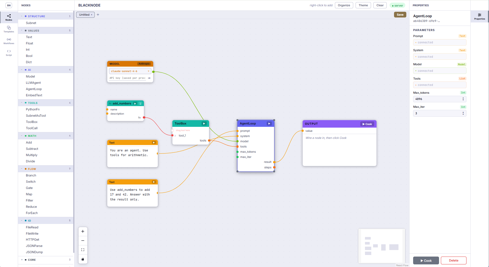
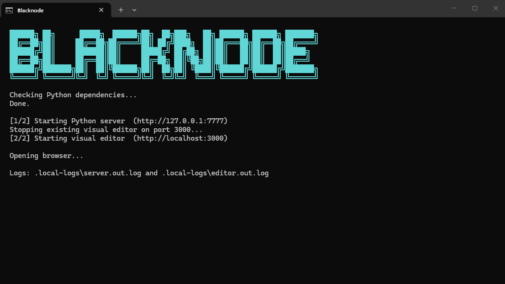
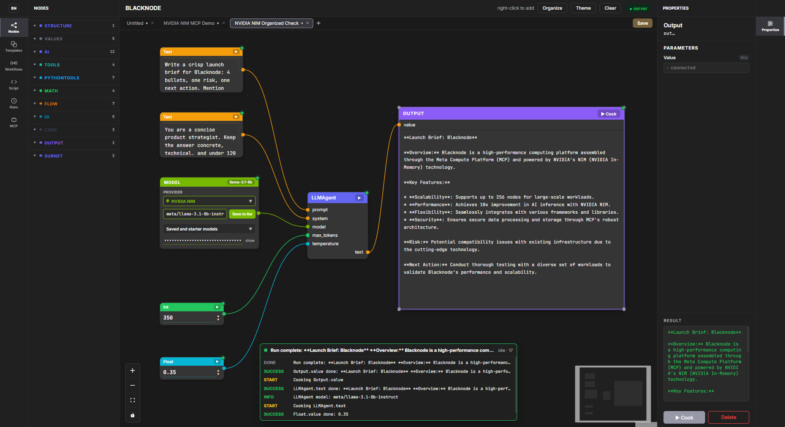

# Blacknode

**The visual workflow builder where AI agents build the workflow.**

Blacknode turns agent intent into typed, visible, runnable workflows. Agents
get a structured control surface through MCP, HTTP, and WebSocket APIs instead
of guessing JSON, and users get a live graph they can inspect, run, replay, and
export.

Workflows export to plain Python, class-based Python, LangGraph, CrewAI,
AutoGen, OpenAI Swarm, and an NVIDIA Agent Stack manifest, with NVIDIA NIM and
AI-Q/NeMo Agent Toolkit workflow paths built in.

<table>
  <tr>
    <td></td>
    <td></td>
  </tr>
  <tr>
    <td></td>
    <td></td>
  </tr>
</table>

<table>
  <tr>
    <td>
      <video src="https://github.com/user-attachments/assets/9debbc72-68d7-4717-9a44-433ae65fd4d2" controls width="420"></video>
    </td>
    <td>
      <video src="https://github.com/user-attachments/assets/16a0d311-f237-4d6f-9fec-c303fc3e41d0" controls width="420"></video>
    </td>
  </tr>
</table>

## Start Here

**New users should begin with the [Beginner Walkthrough](docs/walkthrough.md).**

It shows the exact commands to run, buttons to press, templates to open, results
to expect, NVIDIA NIM paths, MCP setup, framework export, Docker Compose,
custom nodes, run history, and troubleshooting.

## Why Blacknode

Chat agents are good at intent and iteration. They are weak at showing durable
workflow state. Blacknode gives agents a typed workflow editor: they can create
nodes, connect ports, validate the graph, run it, debug failures, replay the
execution, and export the result as code.

## Feature Map

| Feature | What it gives you | Read more |
|---|---|---|
| Visual workflow editor | Build and inspect typed node graphs with visible execution state. | [Beginner Walkthrough](docs/walkthrough.md) |
| Agent control surface | MCP, HTTP, and WebSocket APIs for agents to create, connect, validate, run, save, inspect, and export workflows. | [Agent Guide](docs/agent-guide.md), [MCP Quickstart](docs/quickstart-mcp.md) |
| NVIDIA workflow surface | Hosted NIM, local NIM launch planning, NIM benchmarks, AI-Q/NeMo Agent Toolkit integration, and streamable HTTP MCP. | [NVIDIA Mission Control](docs/nvidia-mission-control.md), [NVIDIA NIM Demo](docs/nvidia-nim-demo.md), [Blacknode and NVIDIA AI-Q](docs/aiq-integration.md) |
| Typed ports and validation | Text, Int, Float, Bool, List, Dict, Embedding, Fn, Model, Number, Any, cycle checks, and MCP repair suggestions. | [Workflow Schema](docs/workflow-schema.md), [Agent Skill](.agents/skills/blacknode-workflow/SKILL.md) |
| Run history and replay | Event logs, model calls, tool calls, node timings, final values, and errors. | [Beginner Walkthrough](docs/walkthrough.md), [Presentation Checklist](docs/presentation-checklist.md) |
| Custom nodes | Persistent editor-created nodes, Python decorator nodes, auto-discovery, and community node packs. | [Custom Nodes](docs/custom-nodes.md) |
| Learned nodes | MCP agents can create reusable Docker-sandboxed node types that appear live in the editor palette. | [Learned Nodes](docs/learned-nodes.md) |
| Python round-trip | Export readable Python, import it back into the editor, and live-sync Python runs into replay. | [Python Round-Trip](docs/python-roundtrip.md) |
| Framework export | Turn a visual graph into Python, LangGraph, CrewAI, AutoGen, OpenAI Swarm, or an NVIDIA Agent Stack manifest. | [Framework Export](docs/framework-export.md) |
| Self-hosted deployment | Run the editor, backend, and HTTP MCP server locally, on a VM, or in an on-prem demo stack. | [Docker Compose](docs/docker-compose.md), [Docker Publishing](docs/docker-publish.md) |

## Learned Nodes

Agents connected via MCP can create new permanent node types when no existing
node fits a task. Generated nodes:

- Are stored as plain Python in `nodes/learned/<name>/`
- Execute inside a Docker sandbox with no network by default
- Appear live in the editor palette under "Learned" or a chosen category
- Persist across sessions and are reusable
- Can be promoted into `custom-nodes/` or `community-nodes/` when stable

Requires Docker. Run `blacknode doctor` to verify your setup.

See [docs/learned-nodes.md](docs/learned-nodes.md) for details and
[docs/learned-nodes-test-plan.md](docs/learned-nodes-test-plan.md) for the
step-by-step test path.

## NVIDIA Agent Stack

Blacknode complements NVIDIA AI-Q and NeMo Agent Toolkit by giving agent
harnesses a visual workflow surface. AI-Q can research and reason over
enterprise data; Blacknode turns agent intent into typed, visible, runnable
workflows through MCP.

**Blacknode is the visual workflow editor for the NVIDIA agent stack.**

See [Blacknode and NVIDIA AI-Q](docs/aiq-integration.md) and
[NVIDIA Mission Control](docs/nvidia-mission-control.md).

## Documentation

### First Run

| Guide | Use it for |
|---|---|
| [Beginner Walkthrough](docs/walkthrough.md) | Step-by-step setup, editor use, CLI checks, NVIDIA workflows, MCP, Docker, and troubleshooting. |
| [Presentation Checklist](docs/presentation-checklist.md) | Fast demo order with actions, expected proof, and feature checkpoints. |
| [MCP Quickstart](docs/quickstart-mcp.md) | Connecting Blacknode to an MCP client. |
| [MCP Test Prompts](docs/mcp-test-prompts.md) | Copy-paste prompts for proving agent workflow control. |

### NVIDIA

| Guide | Use it for |
|---|---|
| [NVIDIA NIM Demo](docs/nvidia-nim-demo.md) | Hosted NVIDIA NIM demo path through MCP and the editor. |
| [NVIDIA Mission Control](docs/nvidia-mission-control.md) | NVIDIA nodes, templates, local readiness, local NIM launch, and benchmark flow. |
| [Blacknode and NVIDIA AI-Q](docs/aiq-integration.md) | Positioning Blacknode beside AI-Q and using streamable HTTP MCP. |

### Deployment

| Guide | Use it for |
|---|---|
| [Docker Compose](docs/docker-compose.md) | Running the editor, backend, and HTTP MCP server as a self-hosted stack. |
| [Docker Publishing](docs/docker-publish.md) | Publishing prebuilt server/editor images to GHCR and running without local builds. |

### Workflow Reference

| Guide | Use it for |
|---|---|
| [Workflow Schema](docs/workflow-schema.md) | The saved workflow JSON format. |
| [Workflow JSON Schema](docs/workflow.schema.json) | Machine-readable schema for validation and tooling. |
| [Framework Export](docs/framework-export.md) | Exporting workflows to Python, LangGraph, CrewAI, AutoGen, Swarm, REST, and WebSocket control. |
| [Python Round-Trip](docs/python-roundtrip.md) | Export Python, import Python back into the editor, and live-sync Python runs into replay. |
| [Custom Nodes](docs/custom-nodes.md) | Persistent editor-created nodes, auto-discovery, community node packs, and node library extension. |
| [Learned Nodes](docs/learned-nodes.md) | MCP-created reusable nodes, opt-in behavior, editor behavior, and user workflow. |
| [Learned Nodes Test Plan](docs/learned-nodes-test-plan.md) | Step-by-step commands for validating Docker, MCP, editor refresh, consent, and the camera demo dry run. |
| [Learned Nodes Internals](docs/learned-nodes-internals.md) | Registry wiring, manifest schema, execution wrapper, and SSE events. |
| [Learned Nodes Sandbox](docs/learned-nodes-sandbox.md) | Docker image, runtime limits, configuration, and troubleshooting. |
| [Agent Guide](docs/agent-guide.md) | How agents should create and modify Blacknode workflows. |
| [Blacknode Skill](.agents/skills/blacknode-workflow/SKILL.md) | Agent skill instructions for workflow creation, validation, running, and export. |

## Demos

| Demo | What it shows |
|---|---|
| [MCP + NVIDIA NIM preview](https://github.com/user-attachments/assets/9debbc72-68d7-4717-9a44-433ae65fd4d2) | Claude opens, organizes, and cooks an NVIDIA NIM workflow through MCP. |
| [Run workflow live replay](https://github.com/user-attachments/assets/16a0d311-f237-4d6f-9fec-c303fc3e41d0) | The editor runs a visible graph with live node highlights and run replay. |
| `python scripts/complex_learned_demo.py --mock-sandbox` | Creates three categorized learned nodes and runs a 14-node workflow without Docker. Use `--open-editor` with `.\start.bat` for the live editor demo. |

## Visuals

| Preview | Link |
|---|---|
| MCP + NVIDIA NIM editor demo | [docs/images/blacknode-mcp-nim-editor-demo.png](docs/images/blacknode-mcp-nim-editor-demo.png) |
| Claude Desktop MCP connector | [docs/images/blacknode-mcp-claude-connector.png](docs/images/blacknode-mcp-claude-connector.png) |
| Research pipeline template | [docs/images/blacknode-research-pipeline.png](docs/images/blacknode-research-pipeline.png) |
| Light theme | [docs/images/blacknode-light-theme.png](docs/images/blacknode-light-theme.png) |
| Dark theme | [docs/images/blacknode-dark-theme.png](docs/images/blacknode-dark-theme.png) |

## Project Map

| Path | Purpose |
|---|---|
| `python/blacknode/` | Python workflow runtime, node registry, providers, CLI, and MCP server. |
| `editor-server/` | FastAPI backend for the visual editor, cook API, workflows, and runs. |
| `editor/` | React visual workflow editor. |
| `templates/` | Tracked starter workflows. |
| `workflows/` | Local saved workflows, ignored by git. |
| `docs/` | Walkthroughs, integration guides, workflow schema, and demo assets. |
| `docker-compose.yml` | Self-hosted editor, backend, and streamable HTTP MCP stack. |
| `crates/` | Rust crates and no-server CLI. |

## License

Blacknode is licensed under the Apache License 2.0. See [LICENSE](LICENSE) for
the full license text.
