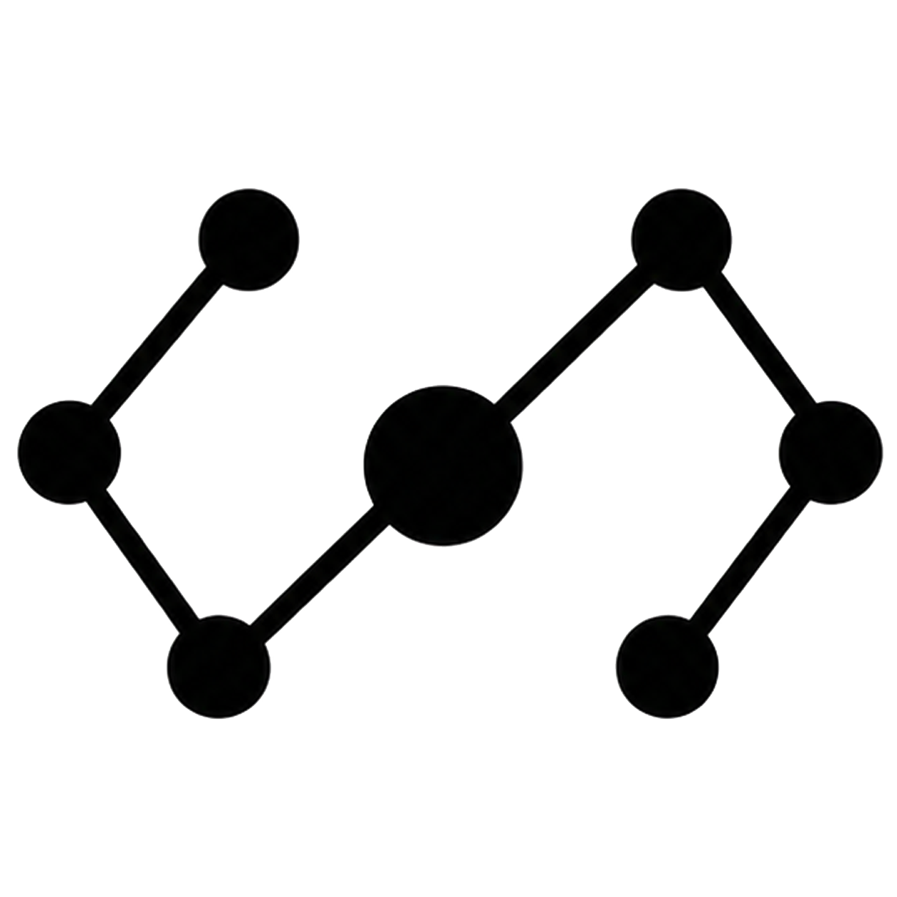

<p align="center">
  
</p>

# Blacknode

[](https://github.com/temiroff/Blacknode/actions/workflows/ci.yml)

**Build, run, inspect, and deploy robot behavior as typed visual workflows.**

Blacknode connects robot hardware, perception, controllers, datasets, training,
simulation, and deployment on one visual canvas. Start with a tested robot
template, inspect live state, authorize a bounded action, and follow every
result through run history and replay.

Workflows stay readable as systems grow: each node has typed ports, each
connection is validated, and hardware-specific implementations remain behind
stable robot capabilities.

## A Robot Workflow, Layer by Layer

A Blacknode robot workflow moves from task intent to physical hardware through
explicit, replaceable layers:

```text
Operator / application / agent
              │
              ▼
Task skills and mission workflows
              │
       ┌──────┴──────┐
       ▼             ▼
  Perception    Controllers + safety
       │             │
       └──────┬──────┘
              ▼
Robot profile, capabilities, calibration, and limits
              │
              ▼
Transport adapters and ROS 2 integration
              │
              ▼
Hardware drivers, cameras, buses, and the physical robot
              │
              └──────── live state and observations flow back up
```

| Layer | What it owns | Packages |
|---|---|---|
| Tasks and missions | Reusable robot skills, planning, confirmation, and orchestration | [`blacknode-skills`](https://github.com/temiroff/blacknode-skills), [`blacknode-agent`](https://github.com/temiroff/blacknode-agent) |
| Perception | Cameras, tracking, VLMs, and spatial observations | [`blacknode-perception`](https://github.com/temiroff/blacknode-perception) |
| Control and safety | Joint control, mobile bases, manipulation, policies, arbitration, limits, freshness checks, and stop paths | [`blacknode-controllers`](https://github.com/temiroff/blacknode-controllers) |
| Robot model | Robot profiles, capability contracts, calibration, discovery, and connection health | [`blacknode-robot`](https://github.com/temiroff/blacknode-robot) |
| Integration | ROS 2 graph, topics, services, processes, native transport, and rosbridge | [`blacknode-ros2`](https://github.com/temiroff/blacknode-ros2) |
| Hardware deployment | Runtime device contracts, capability inspection, safe device control, replaceable adapters, physical drivers, and firmware protocols | [`blacknode-hardware`](https://github.com/temiroff/blacknode-hardware), [`blacknode-drivers`](https://github.com/temiroff/blacknode-drivers) |
| Learning and deployment | Episode recording, policy training, simulation, and accelerated compute | [`blacknode-dataset`](https://github.com/temiroff/blacknode-dataset), [`blacknode-training`](https://github.com/temiroff/blacknode-training), [`blacknode-isaac`](https://github.com/temiroff/blacknode-isaac), [`blacknode-cuda`](https://github.com/temiroff/blacknode-cuda) |

The workflow depends on stable capabilities such as a camera, joint controller,
mobile base, or navigation interface. Robot profiles select the concrete
providers, so compatible hardware or transport changes do not require mission
logic to be rebuilt.

Typical graphs connect live robot state and camera observations to perception,
task skills, bounded control, dataset recording, policy training, and
deployment. Physical motion is disarmed by default and remains guarded by
limits, freshness checks, explicit authorization, and safe shutdown paths.

## Start Blacknode

Requires Python 3.11+ and Node.js 20.19+ or 22.12+.

```powershell
git clone https://github.com/temiroff/Blacknode.git
cd Blacknode
.\start.bat  # Windows
```

```bash
./start.sh   # macOS/Linux, from the cloned repository
```

First run: [Beginner Walkthrough](docs/walkthrough.md) ·
First robot: [SO-ARM101 Quickstart](docs/so-arm101-quickstart.md)

## Extension Packages

Blacknode core provides the graph model, typed runtime, editor, package system,
run replay, exports, and APIs. Robot capabilities live in focused extension
packages with their own nodes, components, templates, and dependencies.

Install packages from the editor's **Packages** tab or the CLI:

```bash
blacknode packages install https://github.com/temiroff/blacknode-robot.git
```

Templates declare required packages and Blacknode resolves missing
capabilities. See [Extension Packages](docs/packages.md).

For deployment on physical hardware, use
[`blacknode-hardware`](https://github.com/temiroff/blacknode-hardware) for
runtime hardware contracts, capability checks, safe device control, and
replaceable adapters. Add
[`blacknode-drivers`](https://github.com/temiroff/blacknode-drivers) for the
physical bus, firmware, or device protocol used by the robot.

## Core Platform

- **Visual workflow editor:** compose and inspect typed node graphs.
- **Validated runtime:** check ports, types, and graph structure before a run.
- **Managed services:** keep cameras, robot drivers, ROS processes, and
  controllers visible and stoppable.
- **Replay and exports:** inspect runs and save workflows as portable artifacts.
- **Control APIs:** operate workflows through MCP, HTTP, and WebSocket.

## Documentation

- Robot: [SO-ARM101](docs/so-arm101-quickstart.md) ·
  [ROSBridge](docs/rosbridge-robot-quickstart.md) ·
  [Leader/follower](docs/so-arm101-leader-follower.md) ·
  [Datasets](docs/episode-datasets.md) ·
  [Policy training](docs/robot-policy-training.md)
- Platform: [Packages](docs/packages.md) ·
  [Workflow schema](docs/workflow-schema.md) ·
  [Custom nodes](docs/custom-nodes.md) ·
  [MCP](docs/quickstart-mcp.md) ·
  [Framework export](docs/framework-export.md)
- Integrations: [NVIDIA Agent Stack](docs/nvidia-agent-stack.md) ·
  [CUDA](docs/nvidia-gpu-blocks.md) ·
  [Docker](docs/docker-compose.md) ·
  [Python round-trip](docs/python-roundtrip.md)
- Development: [Contributing](CONTRIBUTING.md) ·
  [Repository guide](AGENTS.md)

## License

Blacknode is licensed under the Apache License 2.0. See [LICENSE](LICENSE).
