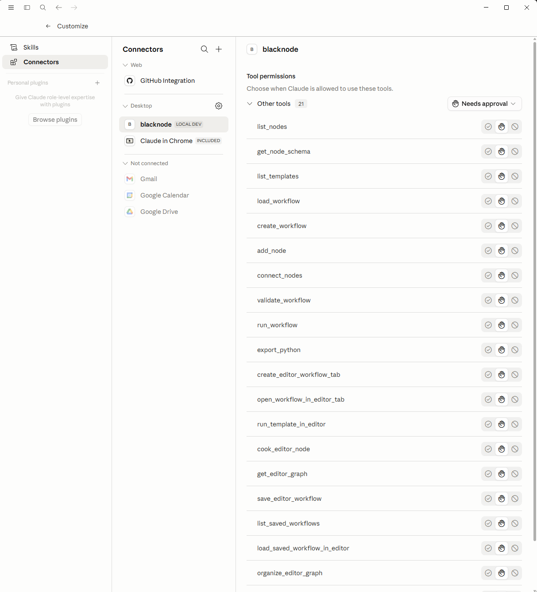

# Blacknode

[](https://github.com/temiroff/Blacknode/actions/workflows/ci.yml)

**The visual workflow builder where AI agents build the workflow.**

Connect Blacknode to Claude Desktop or any MCP client and watch an agent
assemble, validate, run, and debug typed node graphs in a live editor. No
JSON guessing. No fragile graph prompts. When you want code, export the
workflow as readable Python.


▶ **[60-second demo](https://github.com/user-attachments/assets/9debbc72-68d7-4717-9a44-433ae65fd4d2)** — Claude opens, organizes, and cooks an NVIDIA NIM graph through MCP.

```bash
pip install -e ".[mcp]"
./start.sh           # macOS/Linux visual editor
# Windows: start.bat
# MCP command for your client: blacknode mcp
```

Point your MCP client at `blacknode` and ask it to build a workflow like:

> Build me a research pipeline that fetches a URL, summarizes it with Claude, and saves the result to disk.

Blacknode gives the agent typed tools to create the graph, connect ports,
validate the workflow, run it, and inspect the result.

**Status:** public preview. The core workflow format, editor, CLI, templates, MCP tools, and tests are usable, but APIs and graph internals may still change before a stable release.

## Why this is different

- **Visual layer for agent stacks.** Agent harnesses are good at chat, code, and research. They are bad at visual workflow construction. Blacknode gives them a typed visual editor through MCP.
- **MCP-first, not bolted on.** Typed tools let an agent add nodes, connect ports, validate, cook, and inspect runs. Validation reports help the agent self-correct.
- **Live editor control.** The agent drives the running editor, so you can watch the workflow take shape.
- **Typed ports with compatibility rules.** Text, Int, Float, Bool, List, Dict, Embedding, Fn, and Model ports are color-coded and checked before connection.
- **Python export.** Graphs can be exported to readable Python for inspection, versioning, and extension.
- **Run replay.** Every cook creates an event log you can scrub through, with node highlights on the canvas.
- **Flexible model routing.** Anthropic, OpenAI, NVIDIA NIM, and Ollama-style models route from the model string, with keys kept on your machine.

## NVIDIA AI-Q fit

Blacknode is not a deep research agent and does not compete with NVIDIA AI-Q.
AI-Q researches and reasons over enterprise data. Blacknode turns agent intent
into typed, visible, runnable workflows. Together, the positioning is simple:
**Blacknode is the visual workflow editor for the NVIDIA agent stack.**

For AI-Q and NeMo Agent Toolkit MCP clients, Blacknode can serve MCP over
streamable HTTP:

```bash
blacknode mcp --transport streamable-http --host 127.0.0.1 --port 9901 --path /mcp
```

See [Blacknode and NVIDIA AI-Q](docs/aiq-integration.md).

## Demos

| Demo | What it shows |
|---|---|
| [MCP + NVIDIA NIM preview](https://github.com/user-attachments/assets/9debbc72-68d7-4717-9a44-433ae65fd4d2) | MCP opens and cooks a visual NVIDIA NIM workflow in the editor. |
| [Run workflow live replay](https://github.com/user-attachments/assets/16a0d311-f237-4d6f-9fec-c303fc3e41d0) | Top-bar Run button executes the visible graph with live node highlights. |

## Why it exists

Most agent workflows are either code you cannot see as a system, or visual graphs that are hard to automate. Blacknode is meant to sit in the middle:

- Visual editor for inspecting, cooking, saving, and debugging graphs.
- Python runtime and CLI for running workflows outside the browser.
- MCP server so AI agents can assemble workflows through typed tools instead of guessing JSON.
- Run Replay for stepping through saved executions directly on the graph.
- Portable workflow JSON plus Python export for versioning and handoff.
- Local API-key handling for OpenAI, Anthropic, NVIDIA NIM, and Ollama-style local models.

## Try first

No API key required:

```powershell
pip install -e .
blacknode doctor
blacknode demo
```

Visual editor:

```bash
./start.sh
# Windows: start.bat
```

Agent/MCP demo:

```powershell
pip install -e ".[mcp]"
blacknode mcp
```

Then use the copy-paste prompts in [docs/mcp-test-prompts.md](docs/mcp-test-prompts.md), or follow the shorter public-preview path in [docs/quickstart-mcp.md](docs/quickstart-mcp.md).

## Guides

- [MCP quickstart](docs/quickstart-mcp.md)
- [NVIDIA NIM demo](docs/nvidia-nim-demo.md)
- [NVIDIA Mission Control](docs/nvidia-mission-control.md)
- [Blacknode and NVIDIA AI-Q](docs/aiq-integration.md)
- [Docker Compose](docs/docker-compose.md)

---

## Screenshots

### Light theme


### Dark theme


### Research pipeline


### MCP NVIDIA NIM editor demo


### Claude Desktop MCP connector



---

## Quick Start

### Prerequisites

| Tool | Version | Download |
|---|---|---|
| Python | 3.11+ | https://python.org |
| Node.js | 20.19+ or 22.12+ | https://nodejs.org |

### First-time setup (run once)

```bat
pip install -e ".[mcp]"

cd editor-server
pip install -r requirements.txt

cd ..\editor
npm install
```

### Starting the editor

**Windows — double-click `start.bat`** (at the repo root).

It opens one launcher window, starts the Python server and Vite dev server in the background, writes logs to `.local-logs/`, and launches the browser at `http://localhost:3000` automatically. If an old Blacknode editor is already running on port 3000, the launcher restarts it instead of failing. Press **Ctrl+C** in the launcher to stop both services.

Seeing `Stopping existing visual editor on port 3000...` is normal. It means
the launcher found an old Blacknode Vite server and restarted it so the editor
stays on `http://localhost:3000`.


If the same checkout is used from Windows and WSL/Linux/macOS, the launchers
check Vite's native dependency for the current OS and run `npm install` when
that dependency needs repair.

**macOS/Linux — run `./start.sh`** from the repo root:

```bash
chmod +x start.sh
./start.sh
```

It installs missing local dependencies, starts the Python server and Vite dev server, restarts an old Blacknode editor on port 3000 if needed, opens the browser when possible, and stops both servers when you press **Ctrl+C**.

**Manual start (any OS):**

```bash
# Terminal 1 — Python backend
cd editor-server
python server.py
# → http://127.0.0.1:7777

# Terminal 2 — React frontend
cd editor
npm run dev
# → http://localhost:3000
```

Both must be running at the same time. The status indicator in the top bar turns green when the server is reachable.

> Built-in Python node changes are picked up by the backend reload when `server.py` is running. Frontend changes such as port colors are handled by Vite and may need a browser refresh.

---

## Setting up API keys

API keys are entered directly in the **Model node** on the canvas — no `.env` file needed.

1. Add a **Model** node from the AI category in the palette (or load any LLM template)
2. Pick your model from the dropdown
3. Paste your API key in the field below the dropdown
4. Click the 👁 button to verify it, then press Enter or click away

Keys are saved per provider in your browser's `localStorage` and automatically sent to the server on every page load.

| Provider | Where to get a key |
|---|---|
| Anthropic | https://console.anthropic.com |
| OpenAI | https://platform.openai.com/api-keys |
| NVIDIA NIM | https://build.nvidia.com (free tier available) |

---

## Using the editor

### Adding nodes

- **Right-click** the canvas → type to search → click or press Enter
- **Drag** a node from the left palette onto the canvas
- **Click** a node in the palette to place it at a random position
- Node categories in the palette start collapsed so larger node sets stay manageable

### Connecting nodes

Drag from an output handle (right side of a node) to an input handle (left side). Handles are color-coded by type, and compatible types can connect.

| Handle color | Hex | Type |
|---|---:|---|
|  Amber | `#f59e0b` | Text |
|  Green | `#22c55e` | Int |
|  Cyan | `#06b6d4` | Float |
|  Emerald | `#34d399` | Number |
|  Fuchsia | `#e879f9` | Bool |
|  Orange | `#f97316` | List |
|  Purple | `#a855f7` | Dict |
|  Pink | `#ec4899` | Embedding |
|  Red | `#ef4444` | Fn (callable tool) |
|  NVIDIA green | `#76b900` | Model |
|  Grey | `#6b7280` | Any |

Compatibility rules:

- `Any` connects to any type.
- `Int`, `Float`, and `Number` can connect to each other.
- `Model` connects to `Model`, `Text`, or `Any`.
- Other concrete types connect to the same type or `Any`.

Node category/header colors:

| Category | Hex | Nodes |
|---|---:|---|
|  Values | `#6b7280` | Text, Float, Int, Bool, Dict |
|  AI | `#6366f1` | Model, LLMAgent, AgentLoop, VisualAgentLoop, agent-step nodes, EmbedText |
|  NVIDIA | `#76b900` | NVIDIASystemCheck, NVIDIABlueprintPlan, NIMDockerCommand, NIMHealthCheck, NIMAgent, NIMBenchmark |
|  Tools | `#14b8a6` | PythonFn, SubnetAsTool, ToolBox, ToolCall |
|  PythonTools | `#0ea5e9` | web_search, fetch_url, calculator, current_time, regex_extract, json_lookup, text_stats |
|  Math | `#22c55e` | Add, Subtract, Multiply, Divide |
|  Flow | `#d97706` | Branch, Switch, Gate, Map, Filter, Reduce, ForEach |
|  IO | `#0891b2` | FileRead, FileWrite, HTTPGet, JSONParse, JSONDump |
|  Core | `#374151` | Literal, Print, Concat |
|  Output | `#8b5cf6` | Output |
|  Subnet | `#6366f1` | SubnetInput, SubnetOutput |

### Disconnecting lines

- **Click** an edge to select it, then press **Delete** or **Backspace**
- **Double-click** an edge to remove it immediately

### Running a graph

Click the **▶ Cook** button on any node (or on the **Output** node) to evaluate it. Each Cook run starts fresh so file writes, HTTP calls, and model calls do not replay stale cached values.

Results appear in the node's result area. Errors show in red with a full Python traceback.

### Panels and layout

- The left node palette can collapse or resize.
- The right **Properties** panel can collapse or resize the same way, while keeping its icon rail visible.
- Use **Organize** in the top bar to lay out the current graph or subnet.
- Use **Theme** to switch light/dark mode and **Clear** to reset the canvas.
- The server status stays at the right side of the top bar.
- Press **Ctrl+Z** on the canvas to undo graph edits step by step.
- Hold **Alt** while dragging a node to leave the original in place and drop a copy.
- Press **Ctrl+C** / **Ctrl+V** on the canvas to copy selected nodes and paste them at the cursor.

### Templates

Open the **Templates** tab in the left sidebar for one-click starter graphs:

| Template | What it does |
|---|---|
| LLM Chat | System prompt + user message → Anthropic / OpenAI |
| NVIDIA NIM | Same pipeline routed to a free NVIDIA NIM model |
| NVIDIA AI Mission Control | Plan an NVIDIA-backed AI workflow, inspect local readiness, and prepare a NIM endpoint path |
| NVIDIA Local NIM Launch | Generate local NIM Docker commands and endpoint wiring without requiring an API key |
| NVIDIA NIM Benchmark | Benchmark hosted or local NIM latency and return text, metrics, and raw samples |
| Text Pipeline | Concatenate two strings → Output |
| Research Pipeline | HTTPGet → LLMAgent → FileWrite → FileRead, with outputs for saved path and file text |
| Python Tool Agent | PythonFn → ToolBox → AgentLoop tool call |
| Visual Tool Agent | PythonFn → ToolBox → VisualAgentLoop compatibility path |
| Subnet Tool Call | Build a calculator inside SubnetAsTool and test it directly with ToolCall |
| Subnet Tool Agent | Build a calculator inside SubnetAsTool and pass it to AgentLoop |

Templates are loaded from tracked workflow JSON files in `templates/*.json`. They use the same portable workflow format as saved graphs, so they can be validated, exported to Python, shared, and copied into another checkout.

Personal saves from the Workflows tab go to `workflows/*.json`, which is ignored by git until you choose to promote one into `templates/`.

To test a template without installing the package, run from the repo root:

```powershell
$env:PYTHONPATH="python"
python -m blacknode.cli validate templates\text-pipeline.json
python -m blacknode.cli export-python templates\text-pipeline.json --output workflow.py
python workflow.py
```

`text-pipeline.json` prints `Hello World`. `subnet-tool-call.json` is another no-API-key template and prints `59.0` after export:

```powershell
$env:PYTHONPATH="python"
python -m blacknode.cli export-python templates\subnet-tool-call.json --output subnet_tool_call.py
python subnet_tool_call.py
```

LLM templates also export, but running them calls model providers and requires saved or environment API keys.

Checked-in converted examples live at `examples/converted_text_pipeline.py` and `examples/converted_nvidia_nim.py`. The NIM example requires a NVIDIA API key when run outside tests.

### Experimental Rust no-server CLI

The Python runtime is still the canonical runtime. For quick local checks without starting the editor or web server, the experimental Rust CLI can validate, inspect, and run simple deterministic workflows:

```powershell
cargo run -p blacknode-cli -- validate templates\text-pipeline.json
cargo run -p blacknode-cli -- inspect templates\nvidia-nim-mcp-demo.json
cargo run -p blacknode-cli -- run-pure templates\text-pipeline.json
```

`run-pure` is intentionally limited to pure local nodes such as text, values, concat, math, and output nodes. LLM, Python, file, HTTP, subnet, and agent workflows still run through the Python runtime.

### Workflow files

Saved workflows use a versioned JSON format with `kind: "blacknode.workflow"` and `schema_version: 1`. The canonical schema is documented in [docs/workflow-schema.md](docs/workflow-schema.md), with the machine-readable JSON Schema in [docs/workflow.schema.json](docs/workflow.schema.json).

Agents and contributors that need to create or modify workflows should start with [docs/agent-guide.md](docs/agent-guide.md).

Installed as a package, Blacknode exposes a workflow CLI:

```powershell
blacknode validate .\workflows\my-workflow.json
blacknode run .\workflows\my-workflow.json --output .\result.json
blacknode export-python .\workflows\my-workflow.json --output .\workflow.py
blacknode demo
blacknode doctor
blacknode mcp
```

`blacknode demo` runs the built-in no-key text workflow and prints a short success summary. `blacknode doctor` checks the local core runtime, demo template, Node/npm/editor dependencies, MCP extra, and whether the editor server is already running.

`blacknode run` writes a JSON result containing the cooked value plus a structured `events` run log with node timings, errors, model calls, and tool calls:

```json
{
  "run_id": "e5e7b3e2-77a0-40c3-bbd7-02c22b61d5d2",
  "node_id": "out",
  "port": "value",
  "value": "hello",
  "events": [
    { "type": "run_start", "node_id": "out", "port": "value" },
    { "type": "node_start", "node_id": "agent", "node_type": "LLMAgent" },
    { "type": "model_call", "node_id": "agent", "model": "meta/llama-3.1-8b-instruct" },
    { "type": "node_finish", "node_id": "agent", "duration_ms": 118.42 }
  ]
}
```

Run logs are output artifacts, not part of saved workflow files.

### Tool workflows

Tools live in the **Tools** category.

#### PythonFn

Use **PythonFn** when you want a quick inline Python tool.

1. Add a **PythonFn** node.
2. In `code`, define a callable named `run`.
3. Set `name` to the tool name the LLM should see.
4. Set `description` to explain when the tool should be used.
5. Wire `fn` into **ToolBox** for **AgentLoop**, or into **ToolCall** to test it directly.

Example:

```python
def run(query: str) -> str:
    import urllib.request
    return "result"
```

Type annotations on `run` are converted into the tool schema passed to the model.

#### SubnetAsTool

Use **SubnetAsTool** when you want to build the tool visually inside the node.

1. Add a **SubnetAsTool** node.
2. Set `name` and `description`.
3. Dive into the node.
4. Add **SubnetInput** and **SubnetOutput** nodes.
5. Build the internal graph between them.
6. Exit the subnet and wire `fn` into **ToolBox** or **ToolCall**.

The outputs on **SubnetInput** become the tool arguments. The first input on **SubnetOutput** becomes the returned value.

#### ToolBox and ToolCall

**ToolBox** collects any number of connected `Fn` tools into a `List` for `AgentLoop.tools`. It starts with no empty slots; connecting a tool creates a slot, and disconnecting removes the empty slot.

**ToolCall** runs one `Fn` directly with a `Dict` of arguments. Use it to test a PythonFn or SubnetAsTool before giving it to an AgentLoop.

#### VisualAgentLoop

**VisualAgentLoop** has the same inputs, outputs, and runtime behavior as **AgentLoop**. It appears as a diveable subnet-style node with an internal graph showing the agent loop pieces, while the outer node still cooks through the same shared implementation as **AgentLoop**:

| Node | Purpose |
|---|---|
| AgentMessages | Build the initial chat message list from a prompt |
| AgentChatStep | Run one model completion with optional tools |
| ToolDispatch | Execute tool calls against connected `Fn` tools |
| AgentAppendMessages | Append assistant tool calls and tool results to the message list |
| AgentStopCheck | Report whether a loop step should continue or stop |
| AgentFinalAnswer | Ask for a final answer after the tool-call limit |

Those pieces are intentionally available now so the black-box **AgentLoop** can be replaced with a fully visual loop when graph-level loop control is added.

### Custom nodes (Script tab)

Open the **Script** tab and write a Python `@node` function:

```python
from blacknode.node import node

@node(inputs=["text:Text", "n:Int"], outputs=["result:Text"])
def FirstNWords(ctx: dict) -> dict:
    words = ctx.get("text", "").split()
    n = int(ctx.get("n", 10))
    return {"result": " ".join(words[:n])}
```

Press **Ctrl + Enter** (or click Run). The node appears in the **Custom** section of the palette immediately — no server restart needed.

### File IO

**FileWrite** returns the resolved full path on its `path` output, even when the input path is relative. For example, writing `summary.txt` from the editor server returns a path like `F:\PROJECTS\NVDIA\Blacknode\editor-server\summary.txt`.

Wire that `path` output into **FileRead** to read the saved file back into the graph.

---

## Run history

Every cook from the editor (and every `/cook-stream` call) is captured as a
JSON run record under `editor-server/runs/`. Each record has:

- `run_id`, `started_at`, `finished_at`, `duration_ms`
- `status` — `success`, `error`, or `running` for a crashed cook
- `node_id`, `port`, `node_type` — the entrypoint that was cooked
- `node_count`, `model_calls`, `tool_calls`, `cached_nodes` — counters
- `events` — the full ndjson event log emitted during the cook
- `workflow` — a redacted workflow snapshot captured at run start
- `value` (success) or `error` (failure)

The store keeps the most recent 200 runs and prunes older finished runs on
each new run. The directory is git-ignored.

The editor's left sidebar has a **Runs** tab that lists recent runs with a
status badge, duration, and node/model/tool counters. Click a row to expand
its event timeline, replay controls, and result value or error. Replay can
step, play, scrub, and clear a saved execution while highlighting the active
nodes on the canvas. The top-bar **Run** button cooks the current visible
network and streams the same highlights during the first run.

When a run has a workflow snapshot, its detail view includes **Open workflow**.
Use it to restore that graph in a new tab and rerun or inspect it even if the
original workflow is no longer open.

### Endpoints

| Method + path | Purpose |
|---|---|
| `GET /runs?limit=50` | Recent run summaries (no event log), newest first |
| `GET /runs/{run_id}` | Full record with the event log |
| `DELETE /runs/{run_id}` | Remove one run |
| `DELETE /runs` | Clear all runs |

`POST /cook-stream` returns the run id in the `X-Blacknode-Run-Id` response
header, and `POST /cook` returns it as a `run_id` field in the JSON body, so
clients can link the live stream to the persisted record.

---

## MCP server (for AI agents)

Blacknode ships an MCP server so AI agents (Claude Desktop, Cursor, any MCP
client) can build, validate, and run Blacknode workflows through a typed tool
interface — no raw JSON guessing.

The `mcp` Python package is part of `editor-server/requirements.txt`, so the
normal first-time setup (or running `start.bat` / `start.sh`) installs it for
you. If you installed Blacknode as a package, the same dep is available as an
optional extra:

```powershell
pip install -e ".[mcp]"
```

Launch the server over stdio:

```powershell
blacknode mcp
```

Launch the same tool surface over streamable HTTP for MCP clients such as
NVIDIA AI-Q or NeMo Agent Toolkit workflows:

```powershell
blacknode mcp --transport streamable-http --host 127.0.0.1 --port 9901 --path /mcp
```

The HTTP MCP endpoint is `http://127.0.0.1:9901/mcp`.

### Claude Desktop config

Add an entry to `claude_desktop_config.json` (Settings → Developer → Edit Config):

```json
{
  "mcpServers": {
    "blacknode": {
      "command": "blacknode",
      "args": ["mcp"]
    }
  }
}
```

Restart Claude Desktop after saving. In Claude Desktop, open **Customize →
Connectors** and select **blacknode**. It should appear under **Desktop** as a
local connector and expose Blacknode MCP tools such as `list_nodes`,
`get_node_schema`, `list_templates`, `create_workflow`, `run_workflow`,
`run_template_in_editor`, `get_editor_graph`, `save_workflow`,
`list_recent_runs`, and `save_editor_workflow`.


### Exposed tools

| Tool | Purpose |
|---|---|
| `list_nodes` | Every node type, grouped by category, with port schemas |
| `get_node_schema` | Detailed ports + defaults for one node type |
| `list_templates` | Shipped templates in `templates/*.json` |
| `load_workflow` | Read a workflow JSON file |
| `save_workflow` | Validate and write a workflow JSON file |
| `create_workflow` | Empty workflow scaffold with an Output node |
| `add_node` | Add a node; rejects unknown types and subnet types |
| `connect_nodes` | Add an edge; rejects incompatible port types |
| `validate_workflow` | Full schema + type validation |
| `run_workflow` | Execute and return cooked value + event log |
| `export_python` | Convert workflow to a runnable Python script |
| `create_editor_workflow_tab` | Queue a new unsaved workflow tab in the running visual editor |
| `open_workflow_in_editor_tab` | Queue a populated workflow as a new organized visual editor tab |
| `run_template_in_editor` | Queue a tracked template as an organized editor tab and optionally cook it |
| `cook_editor_node` | Queue a live editor node cook, defaulting to `out.value` |
| `get_editor_graph` | Inspect the graph currently loaded in the editor backend |
| `save_editor_workflow` | Save the currently loaded editor graph to `workflows/` |
| `list_saved_workflows` | List saved workflows from the editor backend |
| `load_saved_workflow_in_editor` | Open a saved workflow by slug in the editor UI |
| `list_recent_runs` | List recent editor run summaries |
| `get_run` | Inspect a full run record with events |
| `organize_editor_graph` | Organize and fit the currently open editor graph |
| `rename_editor_tab` | Rename the active editor workflow tab |
| `close_editor_tab` | Close the active editor workflow tab |

Every mutation tool returns a fresh validation report so agents get fast
feedback when they build something invalid. API keys are read from
`editor-server/api_keys.json` (same store the visual editor uses).
By default, `open_workflow_in_editor_tab` also runs the editor's organize layout
and fits the canvas. `run_template_in_editor` keeps the same organize default, so
agents can open `templates/*.json` examples without hand-building every node first.
The live editor tools require the editor backend to be running at
`http://127.0.0.1:7777` or a custom `BLACKNODE_EDITOR_URL`.

### Exposed resources

MCP clients that support resources can inspect project state without first
calling tools:

| Resource | Purpose |
|---|---|
| `blacknode://nodes` | Registered node schemas grouped by category |
| `blacknode://templates` | Tracked templates from `templates/*.json` |
| `blacknode://workflows` | Saved workflows from the running editor backend |
| `blacknode://editor/graph` | Current graph loaded in the running editor backend |
| `blacknode://runs` | Recent run summaries from the running editor backend |

Copy-paste prompts for validating MCP behavior, including an NVIDIA NIM editor
demo that opens, organizes, and cooks a graph, are in
[`docs/mcp-test-prompts.md`](docs/mcp-test-prompts.md).

The NVIDIA NIM MCP demo opens as an organized editor tab and cooks through the
same visual graph controls used by local workflows:


---

## Supported model providers

Connect a **Model** node to any `model` port. The model string is routed automatically:

| Model string | Routes to |
|---|---|
| `claude-sonnet-4-6`, `claude-opus-4-7`, … | Anthropic |
| `gpt-4o`, `o4-mini`, … | OpenAI |
| `nim:meta/llama-3.1-8b-instruct`, … | NVIDIA NIM |
| `ollama:llama3.2`, `ollama:mistral`, … | Ollama (local) |

---

## Running tests

The Python example tests use `unittest` and stub external LLM/network calls, so they do not require an API key:

```powershell
python -m unittest discover -s tests
```

To run the live NIM examples manually, save a NVIDIA NIM key in the editor's Model node API-key field, or set `NVIDIA_API_KEY`:

API keys are resolved in this order:

1. Explicit key passed in code.
2. Environment variable such as `NVIDIA_API_KEY`, `OPENAI_API_KEY`, or `ANTHROPIC_API_KEY`.
3. Editor-saved JSON at `editor-server/api_keys.json`.

```powershell
python .\examples\hello_agent.py
```

---

## Writing a custom node (Python API)

```python
import blacknode as bn

g = bn.Graph()

question = g.node("Text",     value="Summarise Dune in 3 bullets.")
agent    = g.node("LLMAgent", model="nim:meta/llama-3.1-8b-instruct")
output   = g.node("Output")

question.out("value") >> agent.inp("prompt")
agent.out("text")     >> output.inp("value")

g.cook(output, "value")
```

The `@node` decorator registers any Python function as a node type:

```python
from blacknode.node import node

@node(inputs=["prompt:Text", "temp:Float"], outputs=["text:Text"])
def MyNode(ctx: dict) -> dict:
    return {"text": ctx["prompt"].upper()}
```

---

## Project layout

```
blacknode/
├── start.bat                    ← double-click to launch everything
├── start.ps1                    ← Windows one-window launcher
├── start.sh                     ← macOS/Linux launcher
├── docs/
│   ├── agent-guide.md           ← workflow instructions for agents
│   └── workflow-schema.md       ← portable workflow format
├── editor-server/
│   ├── server.py                ← FastAPI backend (port 7777)
│   └── requirements.txt
├── editor/                      ← React + Vite frontend (port 3000)
│   └── src/
│       ├── components/
│       │   ├── BlackNode.tsx    ← color-coded node with typed handles
│       │   ├── ModelNode.tsx    ← model picker with API key field
│       │   ├── OutputNode.tsx   ← result display node
│       │   ├── NodePalette.tsx  ← sidebar (Nodes / Templates / Script)
│       │   ├── ScriptEditor.tsx ← live @node code editor
│       │   └── TemplateGallery.tsx
│       ├── portColors.ts        ← type → hex color + compatibility rules
│       ├── models.ts            ← model picker options per provider
│       └── store.ts             ← Zustand state + server sync
├── templates/                   ← tracked reusable workflow templates
├── workflows/                   ← local saved workflows, ignored by git
├── python/blacknode/
│   ├── graph.py                 ← lazy DAG evaluation engine
│   ├── node.py                  ← @node decorator + registry
│   ├── mcp/                     ← MCP server for AI agents
│   │   ├── tools.py             ← pure-Python tool surface (tested)
│   │   └── server.py            ← FastMCP wrapper
│   ├── providers/               ← LLM provider abstraction
│   │   ├── registry.py          ← auto-route from model string
│   │   ├── anthropic_provider.py
│   │   └── openai_provider.py   ← also covers Ollama, NIM, local
│   └── nodes/
│       ├── ai.py                ← LLMAgent, AgentLoop, VisualAgentLoop, tools
│       ├── core.py              ← Literal, Concat, Switch, ForEach, Output
│       ├── values.py            ← Text, Float, Int, Bool, Model
│       ├── flow.py              ← Branch, Gate, Map, Filter, Reduce
│       └── io.py                ← FileRead, FileWrite, HTTPGet, JSONParse
└── crates/                      ← experimental Rust crates and no-server CLI
```

---

## License

Blacknode is licensed under the Apache License 2.0.
See [LICENSE](LICENSE) for the full license text.
