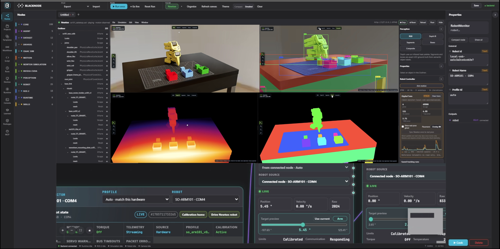

<p align="center">
  
</p>

# Blacknode

[](https://github.com/temiroff/Blacknode/actions/workflows/ci.yml)

**Build a robot workflow, connect its hardware, and deploy it from one visual
workspace.**

Blacknode is a typed node editor and runtime for robotics. Workflows connect
hardware, perception, motion, AI, data, training, and simulation. Blacknode
validates those connections, runs the graph, and keeps its results available
for inspection and replay.



*Newton simulation, rendering passes, robot telemetry, and workflow controls in Blacknode.*

A Project brings the complete application together:

```text
Project
├── workflows
├── paired computers
│   └── attached robots
├── deployments
└── datasets, training runs, policies, and simulation results
```

Projects can guide a direct robot deployment or a longer collect, train,
simulate, and deploy cycle. Physical motion begins disarmed and stays behind
calibration, limits, fresh feedback, explicit authorization, and safe shutdown.

## Quick start

Blacknode requires Python 3.11+ and Node.js 20.19+ or 22.12+.

Windows:

```powershell
git clone https://github.com/temiroff/Blacknode.git
cd Blacknode
.\start.bat
```

macOS or Linux:

```bash
git clone https://github.com/temiroff/Blacknode.git
cd Blacknode
./start.sh
```

The launcher installs the local dependencies and opens
`http://localhost:3000`.

To try the graph first, follow the [Beginner Walkthrough](docs/walkthrough.md).

## Pair your first device

In Blacknode, a **device** is the computer that runs workflows. A **robot** is
hardware attached to that computer. Pair the computer first, then attach its
robots.

For a new Jetson, Raspberry Pi, or Ubuntu computer:

1. Open **Devices → Add device → Remote SSH**.
2. Enter the computer's address, username, and password.
3. Confirm its SSH host fingerprint and press **Confirm and inspect**.
4. Review the read-only system report.
5. Choose **Install Runtime only** for a compute target, or **Install complete
   robot device** when the computer also owns connected robot hardware.
6. Open the device card and select **Attach robot → Find and attach robots**.

Blacknode installs and pairs the Runtime from the editor. The SSH password is
used only for the current request and is not saved. Inspection, installation,
and robot discovery do not arm or move the robot.

To stream a device ROS 2 topic into the editor, connect
`ComputeDevice.device` to `ROS2.device`, set the topic, and start the node.

Other pairing paths:

- Choose **Local computer** to deploy on the editor computer.
- Choose **Remote Manual** to pair an existing Blacknode Runtime with its URL
  and token.

See the [Project Lifecycle](docs/project-lifecycle.md) for isolated stacks,
manual setup, updates, restarts, recovery, and removal.

## Build and deploy

1. Create a **Project**.
2. Choose a tested template or link a saved workflow.
3. Select the paired robot, profile, and calibration required by the workflow.
4. Open **Deploy**, select the robot, and press **Check setup**.
5. When the checks pass, choose **Send to robot** or **Send & run on robot**.

The preflight checks the exact workflow revision, target packages,
capabilities, hardware connection, calibration, and disarmed state. Open
**Deployments** to inspect logs, stop a run, send an update, or roll back.

The optional robot-learning starter prepares collection, training, and
simulation workflows as the Project gains the required data and artifacts. It
never starts a physical or compute action automatically.

## Add capabilities

Blacknode core owns the graph, editor, runtime, replay, exports, package system,
and control APIs. Extension packages add robot providers, ROS 2, perception,
CUDA, datasets, training, simulation, and other focused capabilities. The
[Newton package](https://github.com/temiroff/blacknode-newton) adds Newton
physics workflows, synchronized 3D viewing, ROS bridging, and replay.

Install packages from **Packages** in the editor. The same operation is
available from the CLI:

```bash
blacknode packages install https://github.com/temiroff/blacknode-robot.git
```

Workflow templates declare the packages they need, so missing nodes can be
resolved before a run or deployment.

## Learn more

- [Beginner Walkthrough](docs/walkthrough.md)
- [Project and device lifecycle](docs/project-lifecycle.md)
- [SO-ARM101 Quickstart](docs/so-arm101-quickstart.md)
- [Extension packages](docs/packages.md)
- [Create custom nodes](docs/custom-nodes.md)
- [Workflow schema](docs/workflow-schema.md)
- [MCP quickstart](docs/quickstart-mcp.md)
- [Contributing](CONTRIBUTING.md)

## License

Blacknode is licensed under the Apache License 2.0. See [LICENSE](LICENSE).
