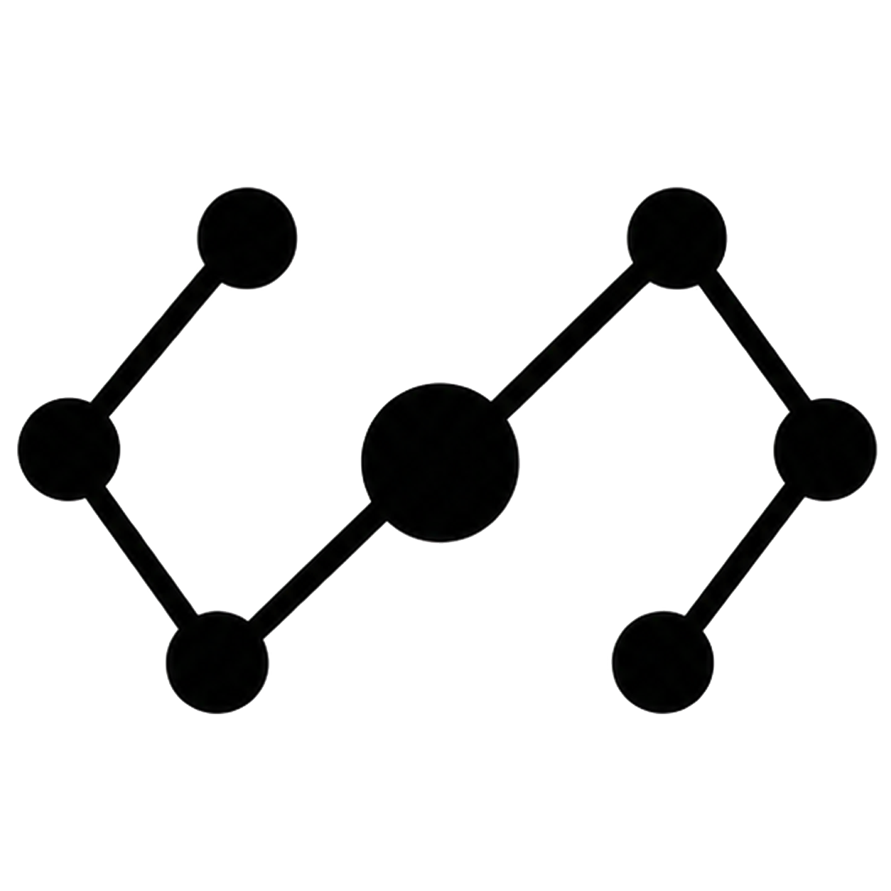

<p align="center">
  
</p>

# Blacknode

[](https://github.com/temiroff/Blacknode/actions/workflows/ci.yml)

**Build, run, inspect, and deploy robot behavior as typed visual workflows.**

Blacknode connects robot hardware, perception, motion, datasets, training,
simulation, and deployment on one visual canvas. Start with a tested robot
template, inspect live state, authorize a bounded action, and follow every
result through run history and replay.

Workflows stay readable as systems grow: each node has typed ports, each
connection is validated, and hardware-specific implementations remain behind
stable robot capabilities.

Robot Hardware can fan timestamped capability telemetry to optional transports.
Its MQTT adapter publishes versioned robot-state streams for dashboards, fleet
systems, and third-party consumers while local hardware control remains
authenticated and independently supervised.

## A Robot Workflow, Layer by Layer

A Blacknode robot workflow moves from task intent to physical hardware through
explicit, replaceable layers:

```text
Operator / application / agent
              │
              ▼
Task skills and mission workflows
              │
       ┌──────┴──────┐
       ▼             ▼
  Perception    Motion + safety
       │             │
       └──────┬──────┘
              ▼
Robot profile, capabilities, calibration, and limits
              │
              ▼
Transport adapters and ROS 2 integration
              │
              ▼
Hardware drivers, cameras, buses, and the physical robot
              │
              └──────── live state and observations flow back up
```

| Layer | What it owns | Packages |
|---|---|---|
| Tasks and missions | Reusable robot skills, persistent memory, and executive mission orchestration | [`blacknode-skills`](https://github.com/temiroff/blacknode-skills), [`blacknode-agent`](https://github.com/temiroff/blacknode-agent) |
| Perception | Cameras, tracking, VLMs, and spatial observations | [`blacknode-perception`](https://github.com/temiroff/blacknode-perception) |
| Motion and safety | Arm and base planning, trajectories, execution, policy, arbitration, and safety | [`blacknode-motion`](https://github.com/temiroff/blacknode-motion) |
| Robot model and devices | Robot profiles, connected-device lifecycle, capability contracts, calibration, discovery, health, and normalized telemetry | [`blacknode-robot`](https://github.com/temiroff/blacknode-robot) |
| Integration | ROS 2 graph, topics, services, processes, native transport, and rosbridge | [`blacknode-ros2`](https://github.com/temiroff/blacknode-ros2) |
| Physical drivers | Concrete device drivers with internal serial, CAN, USB, and other protocol transports | [`blacknode-drivers`](https://github.com/temiroff/blacknode-drivers) |
| Learning and deployment | Episode recording, policy training, remote runtime, simulation, and accelerated compute | [`blacknode-dataset`](https://github.com/temiroff/blacknode-dataset), [`blacknode-training`](https://github.com/temiroff/blacknode-training), [`blacknode-runtime`](https://github.com/temiroff/blacknode-runtime), [`blacknode-isaac`](https://github.com/temiroff/blacknode-isaac), [`blacknode-cuda`](https://github.com/temiroff/blacknode-cuda) |

The workflow depends on stable capabilities such as a camera, joint controller,
mobile base, or navigation interface. Robot profiles select the concrete
providers, so compatible hardware or transport changes do not require mission
logic to be rebuilt.

Typical graphs connect live robot state and camera observations to perception,
task skills, bounded control, dataset recording, policy training, and
deployment. Physical motion is disarmed by default and remains guarded by
limits, freshness checks, explicit authorization, and safe shutdown paths.

## Start Blacknode

Requires Python 3.11+ and Node.js 20.19+ or 22.12+.

```powershell
git clone https://github.com/temiroff/Blacknode.git
cd Blacknode
.\start.bat  # Windows
```

```bash
./start.sh   # macOS/Linux, from the cloned repository
```

First run: [Beginner Walkthrough](docs/walkthrough.md) ·
First robot: [Project Lifecycle](docs/project-lifecycle.md) ·
[SO-ARM101 Quickstart](docs/so-arm101-quickstart.md)

## Extension Packages

Blacknode core provides the graph model, typed runtime, editor, package system,
run replay, exports, and APIs. Robot capabilities live in focused extension
packages with their own nodes, components, templates, and dependencies.

Install packages from the editor's **Packages** tab or the CLI:

```bash
blacknode packages install https://github.com/temiroff/blacknode-robot.git
```

Templates declare required packages and Blacknode resolves missing
capabilities. See [Extension Packages](docs/packages.md).

For deployment on physical hardware, use
[`blacknode-robot`](https://github.com/temiroff/blacknode-robot) for connected
device contracts, lifecycle, health, normalized telemetry, and safe provider
interfaces. Add
[`blacknode-drivers`](https://github.com/temiroff/blacknode-drivers) for the
physical bus, firmware, or device protocol used by the robot.

### Pair a deployed device

On a new Raspberry Pi, Jetson, or Ubuntu device, install the complete hardware
and deployment stack in one pass:

```bash
git clone https://github.com/temiroff/blacknode-runtime.git
cd blacknode-runtime
./install-device.sh
```

This discovers every connected robot, asks for friendly names, installs the
hardware services and shared runtime, configures active UFW rules, verifies the
complete device, and prints the pairing checklist. Rerunning it preserves
existing robot identities, calibrations, names, and the runtime token.

In the Blacknode editor, open **Devices** and select **Add device**. Automatic
SSH setup verifies the host key, authenticates only after confirmation, and
inspects the computer before changing it. The review shows the host OS and
Python, NVIDIA driver and CUDA toolkit, installed ROS 2 distributions, Docker
CLI/daemon state, existing Blacknode runtimes, and occupied runtime ports.
CUDA, ROS 2, and Docker system installations are preserved. Installation shows
live stage progress through package checks, download, isolated Python setup,
service installation, and pairing. If a Blacknode Runtime already exists,
choose to pair the healthy runtime, reinstall that instance, or install an
independent side-by-side instance. Side-by-side instances use separate
directories, state, pairing tokens, systemd services, and the next available
port from `8766` through `8865`. The SSH installer upgrades older downloaded
service scripts in the new checkout when instance isolation support is needed
and verifies that runtimes and robot services which were already active remain
active after the side-by-side setup.

For full separation on one Linux computer, choose **Install a complete
isolated robot stack**. Blacknode creates a separate Runtime checkout and
service plus a separate Robot Hardware checkout, Python environment,
configuration, calibration state, token store, service namespace, and port
allocation. The Hardware environment starts empty. Connect the new robot,
follow the instance-scoped command shown on its device card, and attach the
resulting Hardware pairing details. Existing stacks and robots remain active
and unchanged.

To use the editor computer as the deployment target, choose **Add device →
Local computer**, select the local stack installation folder, and press **Add
local computer**. Blacknode downloads or reuses separate Runtime and Robot
Hardware checkouts, creates separate Python environments and authentication,
selects loopback ports, starts both services, verifies their authenticated safe
state, and pairs the Runtime automatically. Robot Hardware begins disconnected
and disarmed while it waits for a physical robot configuration. The local
computer then uses the same deployment, logs, monitoring, project, and Robot
Hardware screens as a remote computer. Blacknode can pause, resume, and
uninstall both managed processes directly. Editor-created checkout folders are
removed during uninstall; existing source checkouts are preserved.

Runtime instances installed through the editor retain only their non-secret SSH
management identity. **Uninstall runtime** asks for the SSH password again,
shows live cleanup progress, removes the selected instance and its UFW rule,
and leaves other runtime instances on the computer untouched. Uninstalling a
complete isolated stack also removes only its instance-scoped Hardware services
and checkout.
**Remove from editor** deletes only the
local registration. **Pause device** first stops active deployments, stops and
disarms attached robots, then stops that runtime service. **Resume device**
starts the service and reconnects robot monitoring while keeping motion
disarmed; previous deployments stay stopped until explicitly started again.
Each lifecycle action shows stage progress. Each robot also has its own
**Pause robot** and **Resume robot** controls. Robot Pause still sends the
direct hardware stop when its deployment runtime is unavailable and reports
that runtime address as a warning. The robot detail reports physical torque as
**On**, **Off**, or **Unknown**. Unknown includes the provider's readback reason
when available and is treated as possibly on; select the **Physical torque**
fact card to open or close that explanation. Blacknode never infers physical
torque from the separate motion-armed flag. The last verified Robot Hardware
version is retained in the paired-device record, so an active workflow or
temporary version-report outage does not erase it from the robot card.
For robots on SSH-managed computers, **Restart robot service** asks for the SSH
password, resolves the exact hardware systemd unit from that robot's saved
hardware port, and restarts only that unit. Restart is blocked while a
deployment is active or the robot is armed. Blacknode then verifies that the
same authenticated robot returned and keeps motion disarmed.
**Check device** groups installed software into one **Software packages** row
that reports the Runtime and Hardware versions together. If either package
service cannot be reached, that row identifies the affected service. Attached
physical robots remain separate rows and report connected, disconnected,
unknown, unreachable, or still checking, so software health and physical robot
connection remain visible independently.
SSH-managed computers also expose one
**Runtime + Robot Hardware** panel.
On a local computer, **Software packages** opens separate Runtime and Hardware
package cards. Each card shows installed and latest versions plus its running or
stopped state. **Run** and **Stop** control only that package. **Update** advances
and reinstalls only that clean checkout; **Reinstall** repairs its environment;
**Delete** removes its installed environment while preserving source and
configuration for recovery. Device checks are read-only and never start a
stopped package.
Its read-only version check compares installed and latest upstream versions
and commits for both repositories, includes the version reported by each live
service, and states whether each service is current or has an update. **Update
Runtime + Robot Hardware** stops active deployments, stops and disarms attached
robots, verifies trusted clean Git checkouts, fast-forwards them, reinstalls the
packages in their existing environments, and restarts only the matched
services. The report also offers **Update Runtime** and **Update Robot
Hardware** independently, so a valid Runtime update remains available when a
Robot Hardware service needs attention. Runtime has its own installation row.
Robot Hardware has one shared installation row because every robot service on
that compute device uses the same checkout and environment; a compact status
line identifies the robot services that were verified. A Runtime instance with
no attached robots identifies the sibling Runtime card that owns Robot Hardware
on the same managed computer and links to that card. **Restart Robot Hardware**
remains a per-robot action.
Unknown versions and service-resolution errors expose **Repair Runtime** or
**Repair Robot Hardware**. When an authenticated Robot Hardware process was
started manually from the trusted checkout, Repair Robot Hardware verifies and stops only
that listener, installs the saved persistent systemd services, and continues
the update. If an installed unit has drifted to a different HTTP port, Repair
Hardware matches its saved configuration by stable robot identity, reconciles
the service manifest to the editor's paired port, and reinstalls the unit.
An unidentified port owner is never stopped automatically. Local source
changes remain blocked. When every selected commit is current, the
matching control becomes **Reinstall
Runtime + Robot Hardware** and repairs the current package environments before
restarting and verifying the services. Local source changes block either
operation and are never overwritten. The Runtime row exposes **Resolve local
changes** with the verified SSH target, checkout directory, and read-only Git
inspection commands.
Updating does not switch off physical actuator power; a torque warning remains
visible when the updated hardware service reads an enabled servo torque
register. When no deployment is running, the robot card offers an explicitly
confirmed **Release torque** action. It writes only torque-disable values and
verifies the reported physical state afterward; support the robot first because
its joints may move or drop.
Each robot card also exposes **Monitor live**. Select the robot to view its
current joint positions, derived joint speeds, torque state, stream freshness,
and recent per-joint traces. The monitor reads Robot Hardware while the robot
is idle and automatically switches to the running deployment when that process
owns the serial bus. MQTT is optional: it remains available for external
dashboards and fleet consumers, while the editor monitor uses the authenticated
device connection directly. Deployed monitoring requires Runtime 0.3.9 or
newer and `blacknode-drivers` 0.2.1 or newer; restart a running deployment after
updating so it receives the new telemetry channel.
Remote devices initially paired manually can use **Enable SSH controls** later.
Blacknode confirms the SSH host key and enables management only when the
installed systemd runtime matches the pairing's exact port and runtime device
identity. The SSH password remains request-only.

The installer detects each computer's current address; it does not hardcode a
LAN IP. Use a router DHCP reservation or a resolvable hostname for robots that
must keep a stable editor address.

Device records are local to the editor installation at
`.blacknode/devices.json`, which is excluded from Git. Pairing tokens remain in
the editor backend: API responses, workflows, and deployment artifacts refer to
the device ID and do not contain the token. Re-pair the same URL to replace a
rotated token or update the device name.

Plain HTTP protects access with the pairing token but does not encrypt network
traffic. Use it only on a trusted local network; use HTTPS or a private VPN when
the device is reachable through an untrusted network.

### Deploy a workflow to a paired device

Open **Deploy**, select a paired device under **Remote target**, and select
**Check setup**. It verifies the setup and, for a matching connected robot,
activates the selected calibration while the device is disarmed. It does not
start, arm, or move the robot. It checks:

- workflow structure and editor-side package resolution;
- authenticated device-service access and physical hardware connection;
- disarmed state;
- declared `metadata.required_capabilities` against device capabilities;
- calibration when a workflow declares the `joint_group` capability; and
- availability of the target runtime manifest.

Checks appear as pass, warning, failure, or pending. Install and start
`blacknode-runtime` on the target to validate its Python version, Blacknode
version, deployment features, required packages, and registered node types. If
preflight reports an indexed extension package as **will install**, staging
automatically clones it, installs its declared prerequisites, loads its nodes,
and verifies the target manifest before uploading the workflow.

When preflight reports **Ready**, choose:

- **Stage** to export and upload the workflow without starting it.
- **Stage & run** to upload it and explicitly start it on the device.

Blacknode hashes the exact validated graph. If the canvas changes before
staging, the upload is rejected; select **Validate** again so a different graph
cannot be deployed accidentally.

Remote deployments appear below the preflight report. Expand one to view its
device log and use **Run**, **Stop**, **Stage update**, or **Rollback**.
The robot card reports hardware connection and deployment status independently.
Connection shows **Connected**, **Disconnected**, **Checking**, **Unknown**, or
**Unreachable**. Deployment shows **Active**, **Inactive**, **Completed**,
**Failed**, or **None**. An inactive, completed, or failed deployment remains
available on its Runtime and exposes **Restart deployment** and **Deployment
details**, so a Runtime or Hardware reinstall does not require sending the same
workflow again.
**Stage update** uploads the currently validated graph as another revision of
that deployment. **Rollback** selects the previous revision without starting
it; use **Run** after checking its state. A running deployment must be stopped
before it can be updated or deleted. Every remote start rechecks that hardware
is connected and disarmed.

The editor sends runtime requests through its backend, using the hardware and
runtime tokens stored in `.blacknode/devices.json`; the browser never receives
either token.
Existing **Save local** and **Run local** actions continue to operate on the
editor computer.

## Core Platform

- **Visual workflow editor:** compose and inspect typed node graphs.
- **Validated runtime:** check ports, types, and graph structure before a run.
- **Managed services:** keep cameras, robot drivers, ROS processes, and
  controllers visible and stoppable.
- **Replay and exports:** inspect runs and save workflows as portable artifacts.
- **Control APIs:** operate workflows through MCP, HTTP, and WebSocket.

## Documentation

- Robot: [SO-ARM101](docs/so-arm101-quickstart.md) ·
  [ROSBridge](docs/rosbridge-robot-quickstart.md) ·
  [Leader/follower](docs/so-arm101-leader-follower.md) ·
  [Datasets](docs/episode-datasets.md) ·
  [Policy training](docs/robot-policy-training.md)
- Platform: [Packages](docs/packages.md) ·
  [Provider authoring](docs/provider-authoring.md) ·
  [Projects](docs/projects.md) ·
  [Device deployment](docs/deployment-architecture.md) ·
  [Workflow schema](docs/workflow-schema.md) ·
  [Custom nodes](docs/custom-nodes.md) ·
  [MCP](docs/quickstart-mcp.md) ·
  [Framework export](docs/framework-export.md)
- Integrations: [NVIDIA Agent Stack](docs/nvidia-agent-stack.md) ·
  [CUDA](docs/nvidia-gpu-blocks.md) ·
  [Docker](docs/docker-compose.md) ·
  [Python round-trip](docs/python-roundtrip.md)
- Development: [Contributing](CONTRIBUTING.md) ·
  [Repository guide](AGENTS.md)

## License

Blacknode is licensed under the Apache License 2.0. See [LICENSE](LICENSE).
