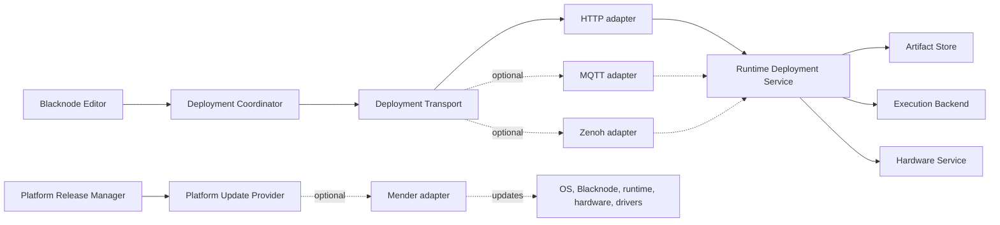

# Modular Device Deployment

Blacknode separates workflow deployment, communication transport, runtime
execution, hardware control, and platform updates. Each layer has a stable
contract and replaceable providers, allowing a device to use direct HTTP today
and a broker, edge data fabric, container executor, or OTA platform later.

## Architecture



Solid lines describe the current direct deployment path. Dotted lines are
provider boundaries intended for optional integrations.

The two update lifecycles remain separate:

- **Workflow deployment** is frequent and interactive. It validates, stages,
  starts, stops, logs, and rolls back a workflow artifact.
- **Platform update** is infrequent and administrative. It updates the
  operating system, Blacknode installation, runtime, hardware package, drivers,
  and device configuration.

An OTA provider may install a new runtime version, but it does not replace the
runtime's workflow-aware deployment service.

## Stable contracts

### Deployment artifact

Every transport carries the same logical artifact:

| Field | Purpose |
|---|---|
| `schema_version` | Selects the artifact contract |
| `name` | Human-readable deployment name |
| `workflow_hash` | Binds the artifact to the exact validated graph |
| `artifact_hash` | Identifies the exported executable content |
| `entrypoint` | Declares what the runtime executes |
| `required_capabilities` | Declares required device capabilities |
| `required_packages` | Declares required target packages |
| `package_requirements` | Declares package source and published version |
| `content` | Executable workflow or a reference to immutable content |

Large artifacts do not have to travel through the command transport. An MQTT
or Zenoh command can carry a content-addressed HTTPS or object-store reference,
while the same artifact manifest and hashes remain authoritative.

### Deployment transport

A transport adapter exposes these semantic operations regardless of protocol:

| Operation | Meaning |
|---|---|
| `manifest` | Read runtime identity, versions, features, and package inventory |
| `list` / `get` | Read desired and observed deployment state |
| `stage` | Validate and store a revision without starting it |
| `start` | Explicitly run the staged revision |
| `stop` | Idempotently stop its complete process or service group |
| `logs` | Read logs using a cursor or bounded tail |
| `rollback` | Select a previous revision, without implicit motion |
| `delete` | Remove a stopped deployment and its stored revisions |

The current provider maps these operations to authenticated HTTP endpoints.
Future providers must preserve the same request and response shapes rather than
leaking protocol-specific topics, sessions, or query objects into the editor.

Every mutating request will support:

- a unique operation ID for idempotent retries;
- device ID and deployment ID;
- expected workflow and revision hashes;
- creation and expiry timestamps;
- explicit acknowledgement and structured errors; and
- authenticated caller identity.

### Runtime deployment service

The runtime owns deployment state independently from its network adapter. Its
service contract is responsible for:

- synchronizing declared extension packages through a replaceable package
  provider before artifact staging;
- validating artifact size, schema, hash, and executable form;
- preserving revisions;
- separating stage from start;
- supervising execution;
- reporting observed state and bounded logs;
- stopping complete process groups; and
- selecting previous revisions.

The current execution backend uses a supervised Python process. A systemd,
container, or another executor can implement the same backend contract later.
The current package provider uses the Blacknode package index and package
manifests. Future image-based executors may resolve the same requirements into
an immutable container or platform release instead.

### Hardware service

The hardware service remains the authority for physical state and commands.
Transport and runtime providers never bypass:

- explicit arming;
- calibration and joint limits;
- command freshness and expiry;
- hardware identity;
- emergency stop and shutdown behavior; or
- capability availability.

The deployment coordinator checks connectivity and disarmed state before a
remote start. Hardware-facing commands still pass through the hardware
service's own safety checks after a workflow starts.

### Platform update provider

A platform update provider reports inventory and manages releases of:

- the operating system and kernel;
- Blacknode core;
- `blacknode-runtime`;
- `blacknode-hardware`;
- device drivers and optional packages; and
- service definitions and non-secret configuration.

Its lifecycle is distinct from workflow revisions:

`available -> downloaded -> installed -> verified -> committed`

A platform rollback restores a software or operating-system release. A
workflow rollback only selects a previous workflow revision.

## Provider roles

| Provider | Intended role | Status |
|---|---|---|
| Direct HTTP | Local-network discovery, commands, state, and logs | Current |
| MQTT 5 | Brokered commands, acknowledgements, status events, and offline fleet communication | Planned adapter |
| Zenoh | Edge queries, pub/sub state, logs, and routed or peer-to-peer communication | Planned adapter |
| Mender | Fleet inventory and OTA updates for device software and operating systems | Planned platform-update adapter |

MQTT and Zenoh are deployment transports. Mender is a platform update
provider. A device may use one from each category—for example, Zenoh for live
deployment control and Mender for signed operating-system updates.

Relevant provider specifications:

- [MQTT 5.0 specification](https://docs.oasis-open.org/mqtt/mqtt/v5.0/mqtt-v5.0.html)
- [Zenoh documentation](https://zenoh.io/docs/)
- [Mender Update Modules](https://docs.mender.io/client-installation/use-an-updatemodule)
- [Mender operating-system updates](https://docs.mender.io/operating-system-updates-yocto-project/overview)

## Configuration and discovery

Provider selection belongs to device configuration, not workflow graphs. A
paired device record will eventually select providers using a shape such as:

```json
{
  "device_id": "workshop-arm",
  "deployment_transport": {
    "provider": "http",
    "endpoint": "http://192.168.1.87:8766"
  },
  "platform_updates": {
    "provider": "none"
  }
}
```

Credentials are referenced by a local credential ID or operating-system secret
store. They are never embedded in workflows, deployment artifacts, browser
responses, logs, or provider-neutral configuration.

The deployment plan sends package source and version from the editor. The
runtime package provider is generic: it does not contain a list of perception,
robot, training, or other extension packages. Publishing a new extension
package or a newer package version therefore does not require a new runtime
release. Package ownership can come from the official package index, explicit
workflow metadata, or the editor's live package registry and Git origin.

## Compatibility requirements

Optional providers must satisfy one shared contract suite. Blacknode considers
a provider compatible only when it demonstrates:

- identical deployment state transitions;
- idempotent retries and duplicate-command handling;
- bounded payload and log behavior;
- reconnect and timeout behavior;
- authentication failures that do not expose credentials;
- revision and workflow-hash enforcement;
- explicit start, stop, and rollback behavior; and
- unchanged hardware safety checks.

The direct HTTP implementation remains the reference provider while additional
adapters are developed.
